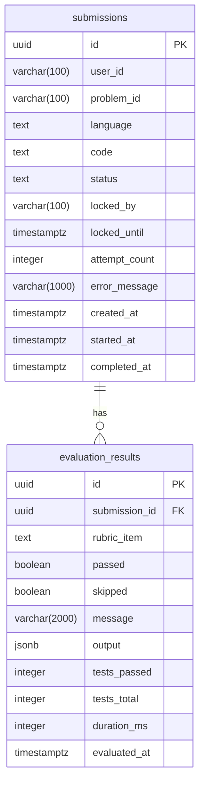
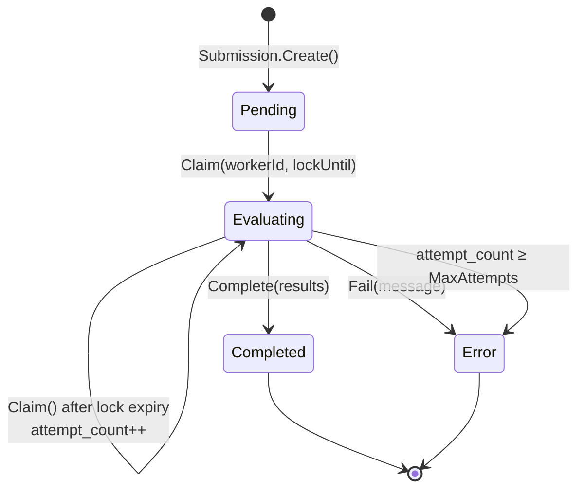
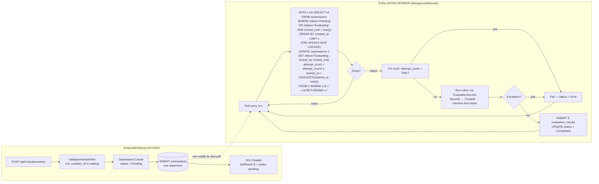
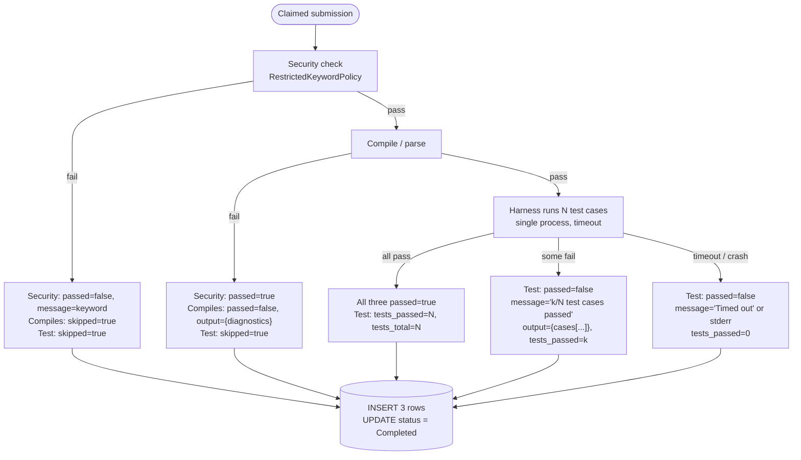

# CodeJudge — Database Design v1.0

| | |
|---|---|
| **Document** | Database Design |
| **Version** | 1.0 — Original design, produced before implementation |
| **Date** | September 2026 |
| **Project** | CodeJudge — Code Submission & Evaluation Platform |
| **Architecture** | Clean Architecture — Modular Monolith |
| **Target DB** | PostgreSQL 17 — EF Core 10 + Npgsql, code-first, snake_case naming |
| **Author** | Vlachos Evangelos |

---

## 1. Introduction

This document describes the initial database design for CodeJudge. It was produced alongside *System Design v1.0* and precedes implementation. The schema reflects the entities, relationships and data patterns required to support the business requirements: instant acceptance of code submissions, asynchronous evaluation by a background worker, per-rubric-item result storage with per-test-case detail, and a paginated per-user history.

The design targets **PostgreSQL with EF Core code-first migrations**. No DDL is included — the schema is declared through `IEntityTypeConfiguration<T>` classes and migrations are generated automatically. Table and column names are **snake_case** via `EFCore.NamingConventions` (`UseSnakeCaseNamingConvention()`), because PostgreSQL folds unquoted identifiers to lower-case and quoted PascalCase identifiers are hostile to anyone using `psql` or pgAdmin. All business constraints are enforced at the domain and application layers; the database provides structural integrity (keys, foreign keys, check constraints, indexes) as a safety net.

A defining property of this schema is that **the `submissions` table is also the job queue**. There is no separate outbox or queue table: a row with `status = 'Pending'` *is* the pending job. This makes "accept a submission" and "schedule its evaluation" a single `INSERT` — atomic by construction — and it shapes the columns (`locked_by`, `locked_until`, `attempt_count`), the claim query (`FOR UPDATE SKIP LOCKED`, §8) and the index strategy (§10).

**Scope:** this is the v1.0 design — the schema as conceived before implementation began. Deviations introduced during implementation are documented in *Database Design v2.0 (As Built)*.

---

## 2. Entity Identification

The following entities were identified from the assignment requirements and the use cases in *System Design v1.0 §3*. Each maps to a distinct table managed by EF Core code-first migrations.

| Entity | Domain | Notes |
|---|---|---|
| **submissions** | Business + Queue | Aggregate root. One row per submitted solution. Owns the lifecycle state machine (`Pending → Evaluating → Completed / Error`). Doubles as the work queue for the Evaluation Worker via `status`, `locked_by`, `locked_until`, `attempt_count`. |
| **evaluation_results** | Business | One row per rubric item per submission (exactly three when evaluated: `Security`, `Compiles`, `Test`). Stores pass/fail, skipped flag, summary message, per-test-case detail (`jsonb`), counts and duration. Child of `submissions`. |

### Entities considered and not modelled in v1

| Candidate | Decision | Reason |
|---|---|---|
| **users** | Not a table | The brief specifies a *user identifier string* on the submission and a static API key for auth. There is no login, profile or per-user secret to store; `user_id` is a client-asserted `varchar` on `submissions`. A `users` table is the natural addition when JWT replaces the API key (System Design §11). |
| **problems** / **test_cases** | Not a table — **in-code catalog** | The brief fixes one hard-coded signature and test per language. v1 generalises this to a `ProblemCatalog` in the Application layer (4 problems, per-language signatures, multiple test cases) that is *validated against* at submission time. Problems are versioned with the code, tested by a catalog self-test, and need no admin UI. Moving them to tables is the first evolution step (§11) and is only justified when problems must change without a deployment. |
| **languages** (lookup) | Not a table | Three fixed values; a `Language` enum stored as `text` with a `CHECK` constraint is simpler and inspectable. |
| **outbox_messages** / **jobs** | Not a table | The submission row is the job. A separate queue table would re-introduce the dual-write problem the design avoids (System Design §6.4). |
| **test_case_results** | Not a table — `jsonb` column | Per-case detail (`id`, `expected`, `actual`, `passed`, `error`, `durationMs`) is read only as a whole, together with its parent result, and never queried by case. `jsonb` on `evaluation_results.output` keeps it structured and queryable if ever needed (`output @> '...'`) without a fourth join. |
| **audit_log** | Not a table | Timestamps on `submissions` (`created_at`, `started_at`, `completed_at`) and `evaluation_results.evaluated_at` provide the audit trail the brief asks for. |

**Design tension:** `submissions` carries both *business* columns (what was submitted, what the outcome was) and *queue* columns (who is processing it, until when). This is a deliberate trade-off: it keeps the enqueue atomic and the schema minimal. If queue churn ever dominates (high-volume polling contending with API reads), the queue columns can be split into a `submission_jobs` table with a 1:1 FK — documented in §11.

---

## 3. Entity Relationship Overview



*Figure 1 — Entity Relationship Diagram. Two tables, one relationship. Enum-typed columns (`language`, `status`, `rubric_item`) are stored as `text` via `HasConversion<string>()` for inspectability — the convention adopted in Vendor Integration Platform v2. PostgreSQL native `ENUM` types were rejected: adding a value needs `ALTER TYPE` in a migration plus Npgsql enum-mapping ceremony, for no query benefit at this scale.*

### Relationship Summary

| Entity Pair | Cardinality | FK Location | Delete Rule | Notes |
|---|---|---|---|---|
| submission ↔ evaluation_result | 1:N (exactly 0 or 3 in practice) | `evaluation_results.submission_id` | `CASCADE` | Results have no meaning without their submission. Cascade is safe: submissions are never deleted by the API in v1; the rule exists for operator retention scripts. |

### Why a child table instead of columns on `submissions`

| Option | Pros | Cons |
|---|---|---|
| Column groups on `submissions` (`security_passed`, `security_message`, `compiles_passed`, …) | • Single-row read.<br/>• No join. | • Schema change for every new rubric item.<br/>• Twelve nullable columns that are null until evaluation.<br/>• Cannot hold per-item output or test-case detail cleanly. |
| Single `jsonb` column on `submissions` (`results`) | • Flexible.<br/>• Single row. | • Rubric items are not first-class rows; "how many submissions fail Security?" needs `jsonb_array_elements`.<br/>• No `UNIQUE (submission, rubric_item)` guard for the duplicate-writer scenario (§8). |
| **Child table `evaluation_results`** | • Adding a rubric item is a new enum value, not a migration.<br/>• 3NF; each result is a first-class, indexable row.<br/>• Per-case detail still structured, inside `output jsonb`. | • One extra join on `GET /submissions/{id}` — three rows, negligible. |

**Selected:** child table with a `jsonb` detail column — rows for what is queried, JSON for what is only displayed.

---

## 4. Submission State Machine

The `Submission` entity owns and controls its lifecycle. All transitions are enforced through domain methods with private setters; the database stores the resulting `status` and never receives an arbitrary update from a service. This is the same encapsulation approach as the `Order` aggregate in the Vendor Integration Platform.



*Figure 2 — Submission Lifecycle State Machine — 4 states, 2 terminal.*

### Allowed Transitions

| From | To | Method | Notes |
|---|---|---|---|
| — | Pending | `Submission.Create(userId, problemId, language, code)` | `created_at = now()`, `attempt_count = 0`. The only state reachable from the API. |
| Pending | Evaluating | `Submission.Claim(workerId, lockUntil)` | `attempt_count = 1`, `started_at = now()`, `locked_by`, `locked_until` set. |
| Evaluating | Evaluating | `Submission.Claim(workerId, lockUntil)` | Only when `locked_until < now()` (previous worker presumed dead). `attempt_count++`. |
| Evaluating | Completed | `Submission.Complete(results)` | Requires exactly one result per `RubricItem`. `completed_at = now()`; lock columns cleared. |
| Evaluating | Error | `Submission.Fail(message)` | System could not evaluate (tooling crash, runtime missing, `MaxAttempts` breached). `error_message`, `completed_at` set. |

### Business Rules Enforced by State Machine

| Rule | Layer | Detail |
|---|---|---|
| Cannot claim a Pending row twice | Domain + DB | `Claim()` throws `InvalidStatusTransitionException` unless `status == Pending` or (`status == Evaluating` and lock expired). The claim query's `FOR UPDATE SKIP LOCKED` prevents two workers reading the same row (§8). |
| Cannot complete or fail a non-Evaluating row | Domain | `Complete()` / `Fail()` validate `status == Evaluating`. |
| Results are all-or-nothing | Domain | `Complete()` requires one result for each of the three `RubricItem` values; partial results are rejected. |
| Terminal states are immutable | Domain | No method transitions out of `Completed` or `Error`. |
| Poison-message protection | Application (worker) | Before evaluating a claimed row, the worker checks `attempt_count > MaxAttempts` and calls `Fail("Max attempts exceeded")` instead. |
| `Completed` ≠ "passed" | Domain semantics | `Completed` means the rubric ran. A non-compiling submission is `Completed` with `Compiles.passed = false`. `Error` is reserved for system failures. |
| Unknown problem never reaches the queue | Application (validator) | `problem_id` is validated against `IProblemCatalog` at `POST` time → `400 / ProblemNotFound`. The worker can assume the problem exists. |

---

## 5. Functional Dependencies and Normalisation

All tables satisfy Third Normal Form (3NF). Each non-key attribute depends on the whole key and nothing but the key.

| Table | Primary Key | Key Functional Dependencies | NF |
|---|---|---|---|
| submissions | `id` | `id → user_id, problem_id, language, code, status, locked_by, locked_until, attempt_count, error_message, created_at, started_at, completed_at` | 3NF |
| evaluation_results | `id` (surrogate) with `UNIQUE (submission_id, rubric_item)` | `id → submission_id, rubric_item, passed, skipped, message, output, tests_passed, tests_total, duration_ms, evaluated_at`; also `(submission_id, rubric_item) → all` | 3NF |

### Surrogate vs natural key on `evaluation_results`

`(submission_id, rubric_item)` is a valid natural composite key. A surrogate `id` is used instead, with the natural key enforced as a unique index, for two reasons: EF Core handles single-column keys with less configuration friction (composite keys on owned collections were the root of the `DbUpdateConcurrencyException` recorded in the VIP README), and a stable `id` is useful if results are ever exposed as addressable resources.

### `jsonb` and normalisation

`evaluation_results.output` holds an array of per-test-case objects. Strictly this is a multi-valued attribute; it is accepted as a documented exception because the cases are only ever read together with their parent row and never filtered, joined or updated individually. The summary columns that *are* queried (`tests_passed`, `tests_total`, `duration_ms`) are promoted to real columns. If per-case analytics are needed ("which case fails most often?"), `test_case_results` becomes a table (§11).

### Deliberately stored derivable fields

| Field | Derivable from | Why stored |
|---|---|---|
| `submissions.status` | `evaluation_results` existence + `error_message` | The worker's claim query filters on `status`; inferring it would require a join on the hot polling path. `status` is the queue discriminator. |
| `evaluation_results.skipped` | An earlier rubric item failing | Explicit flag makes the API response unambiguous without the client re-deriving rubric order. |
| `evaluation_results.tests_passed` / `tests_total` | Counting `output` | Cheap to store, avoids `jsonb_array_length` in the list endpoint and in analytics. |

---

## 6. Data Dictionary

Types are PostgreSQL types as generated by Npgsql from EF Core configuration. All primary keys are `uuid` generated at the domain layer with `Guid.CreateVersion7()` — time-ordered, so B-tree inserts are append-mostly. All timestamps are `timestamptz` (UTC; Npgsql requires `DateTime.Kind == Utc`).

### submissions

| Column | Type | Constraints | Description |
|---|---|---|---|
| `id` | uuid | PK | Submission identifier returned to the client. UUID v7. |
| `user_id` | varchar(100) | NOT NULL | Client-asserted user identifier. Not a FK in v1 (no `users` table). |
| `problem_id` | varchar(100) | NOT NULL | Catalog problem id (e.g. `two-sum`). Validated against `IProblemCatalog` at `POST`; not a FK in v1 (catalog is in code). |
| `language` | text | NOT NULL, CHECK IN ('CSharp','Python','JavaScript') | Enum `Language` via `HasConversion<string>()`. |
| `code` | text | NOT NULL | Source code as submitted. Size limit (64 KB) enforced by FluentValidation. |
| `status` | text | NOT NULL, CHECK IN ('Pending','Evaluating','Completed','Error') | Enum `SubmissionStatus` via `HasConversion<string>()`. Queue discriminator — see §8. |
| `locked_by` | varchar(100) | NULL | Worker instance id (`{MachineName}:{ProcessId}:{Guid}`) holding the claim. NULL when not `Evaluating`. |
| `locked_until` | timestamptz | NULL | Lock expiry. A row in `Evaluating` with `locked_until < now()` is re-claimable. |
| `attempt_count` | integer | NOT NULL DEFAULT 0 | Times claimed. Incremented on each claim. Compared against `Evaluation:MaxAttempts`. |
| `error_message` | varchar(1000) | NULL | Set only when `status = 'Error'`. System-level failure reason (not a rubric message). |
| `created_at` | timestamptz | NOT NULL | Set by `Create()`. Ordering key for the queue and for the user history list. |
| `started_at` | timestamptz | NULL | Set on first claim. `started_at - created_at` = queue wait time. |
| `completed_at` | timestamptz | NULL | Set by `Complete()` or `Fail()`. `completed_at - started_at` = evaluation duration. |

### evaluation_results

| Column | Type | Constraints | Description |
|---|---|---|---|
| `id` | uuid | PK | Surrogate key. |
| `submission_id` | uuid | FK → submissions.id, NOT NULL, ON DELETE CASCADE | Parent submission. |
| `rubric_item` | text | NOT NULL, CHECK IN ('Security','Compiles','Test') | Enum `RubricItem` via `HasConversion<string>()`. `UNIQUE (submission_id, rubric_item)`. |
| `passed` | boolean | NOT NULL | Rubric outcome. `false` when skipped. |
| `skipped` | boolean | NOT NULL DEFAULT false | `true` when an earlier item failed and this one was not executed. |
| `message` | varchar(2000) | NULL | Short, display-safe summary: matched restricted keyword; first compiler diagnostic; `"3/4 test cases passed"`; `"Timed out after 5000 ms"`. |
| `output` | jsonb | NULL | Structured detail. For `Compiles`: `{ "diagnostics": [ { "line", "column", "code", "message" } ] }`. For `Test`: `{ "cases": [ { "id", "args", "expected", "actual", "passed", "error", "durationMs" } ] }`. Capped by the evaluator (16 KB). |
| `tests_passed` | integer | NULL | `Test` item only: number of cases that passed. |
| `tests_total` | integer | NULL | `Test` item only: number of cases run. |
| `duration_ms` | integer | NULL | Wall-clock time of this rubric step (compile time, or total harness run time). |
| `evaluated_at` | timestamptz | NOT NULL | When this item was recorded. |

`CHECK (tests_passed IS NULL OR tests_total IS NULL OR tests_passed <= tests_total)` is added as a sanity constraint.

### Enum → text mapping reference

| Enum (Domain) | Stored text | Wire (API, camelCase) | int |
|---|---|---|---|
| `Language` | `CSharp`, `Python`, `JavaScript` | `csharp`, `python`, `javascript` | 0, 1, 2 |
| `SubmissionStatus` | `Pending`, `Evaluating`, `Completed`, `Error` | `pending`, `evaluating`, `completed`, `error` | 0, 1, 2, 3 |
| `RubricItem` | `Security`, `Compiles`, `Test` | `security`, `compiles`, `test` | 0, 1, 2 |

No string literal for any of these values exists in application code: the database mapping is `HasConversion<string>()`, the wire mapping is `JsonStringEnumConverter(JsonNamingPolicy.CamelCase)` (accepting input case-insensitively).

---

## 7. CRUD Matrix

Maps each API endpoint and each worker step to the tables it touches. Writes marked with an asterisk are gated on domain state validation before any database write.

| Operation | Actor | submissions | evaluation_results | Transaction |
|---|---|---|---|---|
| `POST /api/v1/submissions` | Client | INSERT | — | Single statement (implicitly atomic). This *is* the enqueue. |
| `GET /api/v1/submissions/{id}` | Client | SELECT | SELECT (via `Include`, ordered by `rubric_item`) | Read-only. |
| `GET /api/v1/users/{userId}/submissions?page&pageSize` | Client | SELECT (`COUNT(*)` + `OFFSET … LIMIT …`) | — | Read-only. Projection covered by index (§10); results not included in list items. |
| `GET /api/v1/problems` | Client | — | — | In-code catalog; no DB access. |
| Worker — claim batch | Worker | UPDATE\* (`status`, `locked_by`, `locked_until`, `attempt_count`, `started_at`) via CTE + `RETURNING` | — | Single statement — atomic claim (§8). |
| Worker — complete | Worker | UPDATE\* (`status = Completed`, `completed_at`, lock cleared) | INSERT × 3 | One `SaveChangesAsync` = one transaction. |
| Worker — fail | Worker | UPDATE\* (`status = Error`, `error_message`, `completed_at`) | — | Single statement. |
| `GET /health` | Client / infra | `SELECT 1` | — | Connectivity probe only. |

\* Only permitted from the states listed in §4. Validated at the domain layer before `SaveChangesAsync`.

No endpoint performs `DELETE`. Submissions are immutable after creation from the client's point of view; retention/purge is an operator concern (§11).

---

## 8. Database-as-Queue — Claim Flow and Scenarios

The key guarantee is the same one the Outbox pattern provides in the Vendor Integration Platform, achieved with fewer moving parts: **there is no moment at which a submission has been accepted but not scheduled**, because acceptance and scheduling are the same row. The second guarantee is **exactly-once claiming under concurrency**, provided by PostgreSQL's `FOR UPDATE SKIP LOCKED` — the primitive this pattern was designed around.



*Figure 3 — Claim flow. The CTE selects and locks candidate rows, skipping any already locked by another worker; the `UPDATE … RETURNING` claims them and returns the full rows in one round trip.*

### Claim query (reference)

Executed via `Database.SqlQueryRaw<Submission>` in `SubmissionClaimer` (Infrastructure). Parameters: `@n` batch size, `@workerId`, `@lockUntil`.

```sql
WITH candidates AS (
    SELECT id
    FROM   submissions
    WHERE  status = 'Pending'
       OR (status = 'Evaluating' AND locked_until < now())
    ORDER  BY created_at
    LIMIT  @n
    FOR UPDATE SKIP LOCKED
)
UPDATE submissions s
SET    status        = 'Evaluating',
       locked_by     = @workerId,
       locked_until  = @lockUntil,
       attempt_count = s.attempt_count + 1,
       started_at    = COALESCE(s.started_at, now())
FROM   candidates c
WHERE  s.id = c.id
RETURNING s.*;
```

The domain `Claim()` method exists for unit-testability and as documentation of the transition; in production the claim is performed by this single statement to avoid a read-then-write race. This is a deliberate, documented exception to "all mutations go through domain methods" — the same pragmatic exception the VIP outbox worker makes with `Lock(workerId, lockedUntil)`.

### Worker settings

| Setting | Default | Source |
|---|---|---|
| Polling interval | 2 s | `Evaluation:PollingIntervalSeconds` |
| Batch size | 5 | `Evaluation:BatchSize` |
| Lock duration | 90 s | `Evaluation:LockDurationSeconds` — must exceed compile timeout + (cases × per-run timeout) with margin |
| Compile timeout | 10 s | `Evaluation:CompileTimeoutSeconds` |
| Run timeout | 5 s per harness invocation (all cases in one process) | `Evaluation:RunTimeoutSeconds` |
| Max attempts | 3 | `Evaluation:MaxAttempts` |

### Failure Scenarios

| Scenario | Queue behaviour | Submission state |
|---|---|---|
| API restarts after `201`, before any poll | Row is `Pending`; next poll claims it. Nothing lost. | Pending → Evaluating → Completed |
| Worker dies mid-evaluation | `locked_until` passes; next poll re-claims; `attempt_count = 2`. | Evaluating → Evaluating → Completed |
| Worker dies on the same row repeatedly | When a claim yields `attempt_count > MaxAttempts`, worker calls `Fail()`. | Evaluating → Error ("Max attempts exceeded") |
| Two workers poll simultaneously | `SKIP LOCKED` skips rows locked by the other worker's open transaction; each row claimed once. | Normal |
| Evaluation exceeds lock duration (mis-configured timeout) | Second worker re-claims while first still runs → duplicate `INSERT` attempted. `UNIQUE (submission_id, rubric_item)` rejects the second; loser logs and discards. | Completed (first writer wins) |
| Database unreachable | Claim throws; worker logs warning and sleeps until next poll. | Unchanged |
| Submitted code loops forever | Not a queue concern — harness process killed at timeout; `Test` recorded as failed with `"Timed out"`. | Completed |
| `python`/`node` missing on host | Evaluator throws `RuntimeNotAvailableException`; caught per item. | Error ("runtime not available: node") |

---

## 9. Rubric Result Storage — Design and Semantics

The rubric has three ordered items. The order is a business rule, not an implementation detail: **Security → Compiles → Test**. A failure at any step short-circuits the rest; the skipped items are still recorded so the client always receives exactly three results. The `Test` item runs *all* catalog test cases for the problem in one harness invocation and passes only if every case passes.



*Figure 4 — Rubric outcomes and the rows they produce. Every outcome writes exactly three `evaluation_results` rows.*

### Design Decisions

| Decision | Choice | Reason |
|---|---|---|
| Always three rows | Yes, including skipped | Client contract is stable: `results.length === 3`. Queries like "% failing Security" do not need to infer absence. |
| Where `skipped` is decided | `EvaluationService` (Application) | Rubric order is a business rule; the language evaluators only know how to compile and run. |
| `message` vs `output` | Both | `message` is the short, display-safe summary (≤ 2000 chars). `output` is structured `jsonb`, capped by the evaluator; never rendered without escaping. |
| Per-case detail in `jsonb`, counts as columns | Hybrid | Cases are displayed together and never queried individually; counts are queried (list endpoint, analytics). |
| Where the test spec lives | Code (`ProblemCatalog`) | Versioned with evaluators, covered by a self-test. Tables when problems must change without deploy (§11). |
| `passed` on skipped rows | `false` | Avoids a three-valued nullable boolean; `skipped = true` carries the distinction. |
| All cases in one harness process | Yes | One process spawn per submission instead of N; harness reports per-case duration. Trade-off: one hanging case times out the whole run — acceptable, and the message says so. |

---

## 10. Index Strategy

EF Core manages indexes via `HasIndex()` (with `HasFilter()` for partial indexes and `IncludeProperties()` for covering columns — both supported by Npgsql). Each index below serves a specific, identified access path. No speculative indexes are included; in particular, no index on `language` (three values) or on any boolean column, applying the lesson recorded in VIP Database Design v2 §7.

| Index | Table | Columns | Type | Query pattern |
|---|---|---|---|---|
| `pk_submissions` | submissions | `id` | PK (B-tree) | `GET /submissions/{id}`; FK target. UUID v7 keeps inserts near the right edge of the B-tree. |
| `ix_submissions_queue` | submissions | `status, locked_until, created_at` | **PARTIAL** `WHERE status IN ('Pending','Evaluating')` | The claim query — hottest query in the system. Partial so it stays tiny as `Completed` rows accumulate; `created_at` gives FIFO order for `ORDER BY … LIMIT`. |
| `ix_submissions_user_id_created_at` | submissions | `user_id, created_at DESC` | B-tree, `INCLUDE (problem_id, language, status)` | `GET /users/{userId}/submissions` — seek on user, ordered scan for paging; list projection is index-only. |
| `pk_evaluation_results` | evaluation_results | `id` | PK | Surrogate key. |
| `ux_evaluation_results_submission_rubric` | evaluation_results | `submission_id, rubric_item` | UNIQUE | One result per rubric item (§5); serves the `Include` on `GET /submissions/{id}`; duplicate-writer guard (§8). |

Indexes considered and rejected:

| Candidate | Reason rejected |
|---|---|
| `submissions(status)` alone | Subsumed by the partial queue index; an unfiltered version would index every `Completed` row for no query. |
| `submissions(problem_id)` | No endpoint filters by problem in v1. Add with per-problem statistics. |
| `submissions(language)` | Three distinct values — planner would ignore it. |
| GIN on `evaluation_results.output` | No `jsonb` containment queries in v1. Add if per-case analytics are needed. |
| `evaluation_results(submission_id)` non-unique | Redundant with the unique composite whose leading column is `submission_id`. |

---

## 11. Evolution Path

| Change | Trigger | Schema impact |
|---|---|---|
| `users` table + FK | JWT replaces API key | `submissions.user_id` becomes `uuid` FK. Migration with a mapping step for existing string ids. |
| `problems` + `test_cases` tables | Problems must change without a deployment, or an admin UI is required | `problems (id text PK, title, description, difficulty)`, `problem_signatures (problem_id, language, function_name, signature)`, `test_cases (id, problem_id, args jsonb, expected jsonb, is_sample)`. `submissions.problem_id` becomes FK. `IProblemCatalog` gets a repository implementation; validator unchanged. |
| `test_case_results` table | Per-case analytics ("which case fails most?") | Extract from `output jsonb`; `evaluation_result_id` FK; keep `output` for display or drop it. |
| Split queue columns | Polling contention with API reads at scale | `submission_jobs (submission_id PK/FK, locked_by, locked_until, attempt_count, next_retry_at)`; `submissions` becomes read-mostly. |
| Scoring / leaderboard | Product requirement | `score numeric` on `submissions`; materialised view per user/problem — first legitimate CQRS read model. |
| Retention / purge | Table growth | Scheduled job deleting `Completed`/`Error` rows older than N days; `ON DELETE CASCADE` on results already in place. Consider partitioning `submissions` by `created_at` month if volume warrants. |
| Optimistic concurrency | Multiple API writers on the same row (not present in v1) | `xmin` as concurrency token (`UseXminAsConcurrencyToken()`, Npgsql-native, no extra column). |

---

## 12. Summary

The database design directly supports the Clean Architecture system design. Two tables serve every use case. Business logic lives in the domain and application layers; the database enforces structural integrity through primary/foreign keys, check constraints on enum columns, a unique constraint on rubric results, and three purpose-built indexes including a partial index for the queue. The `submissions` table doubling as the job queue gives atomic enqueue without an outbox, and `FOR UPDATE SKIP LOCKED` gives safe concurrent claiming.

| Deliverable | Status | Section |
|---|---|---|
| Entity Identification | Complete | Section 2 |
| ER Diagram | Complete | Section 3 — Figure 1 |
| Submission State Machine | Complete | Section 4 — Figure 2 |
| Normalisation (3NF) | Complete | Section 5 |
| Data Dictionary | Complete | Section 6 |
| CRUD Matrix | Complete | Section 7 |
| Queue / Claim Flow | Complete | Section 8 — Figure 3 |
| Rubric Result Storage | Complete | Section 9 — Figure 4 |
| Index Strategy | Complete | Section 10 |
| Evolution Path | Complete | Section 11 |
| SQL DDL | Excluded | EF Core code-first migrations |
| Stored Procedures | Excluded | Business logic lives in the application, not the database. The single raw claim statement is the documented exception. |

This is the v1.0 design document — the schema as conceived before implementation. Changes introduced during implementation (additional columns, revised indexes, new statuses, type corrections) are documented in *Database Design v2.0 (As Built)*.

---

*CodeJudge — Database Design v1.0 — September 2026 — Author: Vlachos Evangelos*
