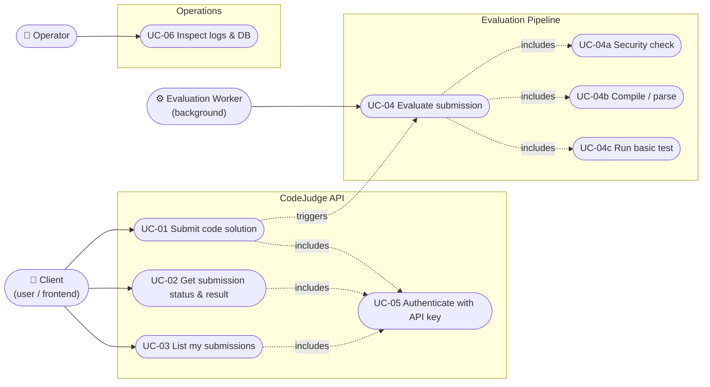
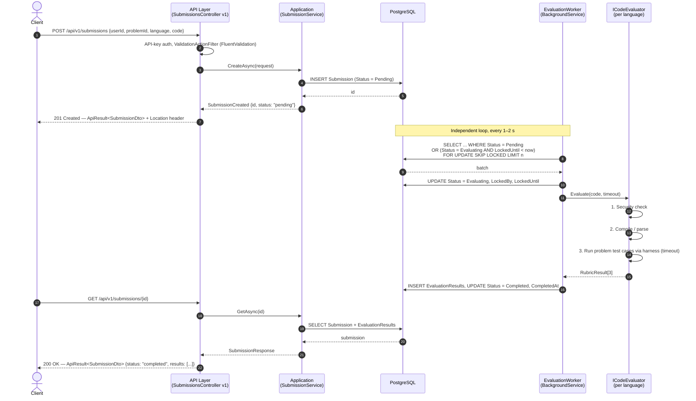
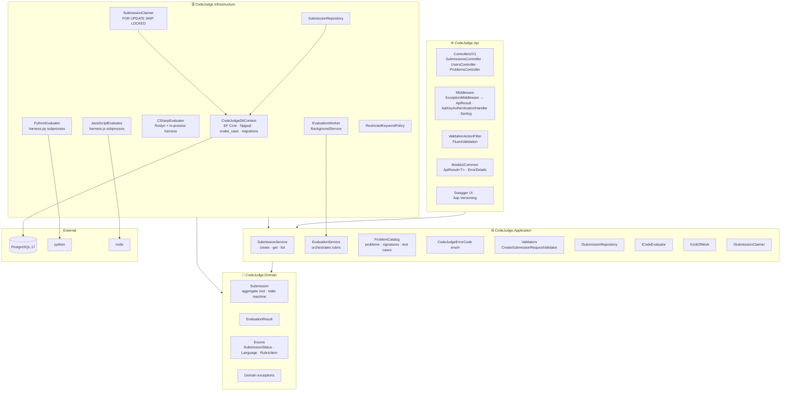
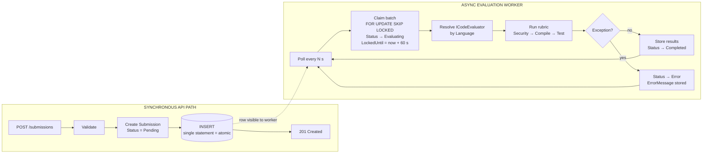
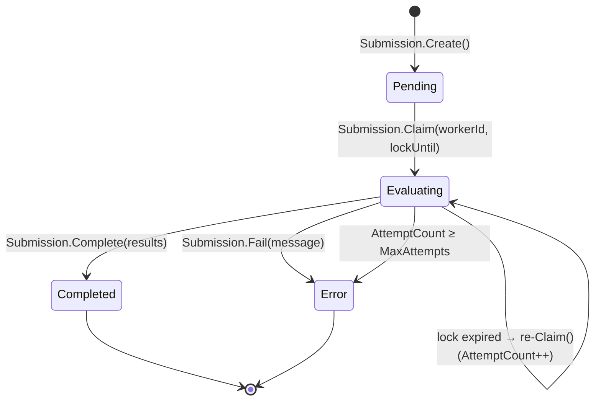
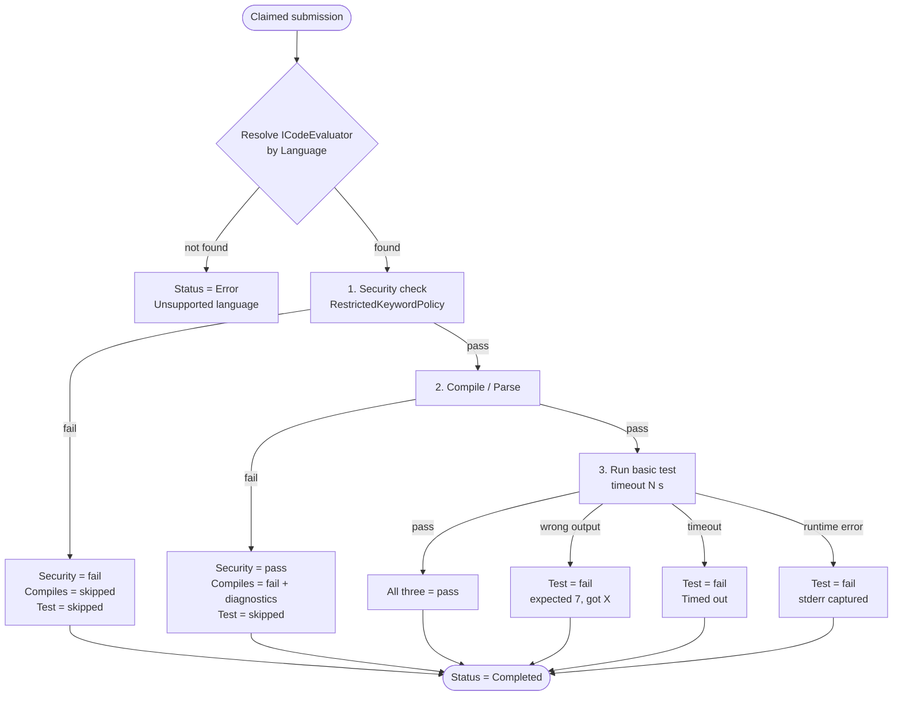

# CodeJudge — System Design v1.0

| | |
|---|---|
| **Document** | System Design |
| **Version** | 1.0 — Original design, produced before implementation |
| **Date** | September 2026 |
| **Project** | CodeJudge — Code Submission & Evaluation Platform |
| **Architecture** | Clean Architecture — Modular Monolith, no CQRS |
| **Stack** | .NET 10 / ASP.NET Core (Controllers, API versioning) / EF Core 10 + Npgsql / PostgreSQL 17 |
| **Author** | Vlachos Evangelos |

---

## 1. Introduction

CodeJudge is the backend of a mini-platform where users submit code solutions (for example, answers to coding-interview questions) that are evaluated automatically against a simple rubric. The system must accept submissions instantly, evaluate them asynchronously in the background, and expose the status and results through a REST API that a frontend could later consume.

The problem has two defining characteristics that drive every design decision below:

1. **The API must never wait for evaluation.** Compiling and running code takes seconds; an HTTP request must return in milliseconds. The evaluation pipeline is therefore an asynchronous, out-of-band process with its own lifecycle.
2. **The evaluated code is untrusted.** A submission may be malicious, may loop forever, or may fail to compile. The evaluation boundary must isolate these failures from the API and from other submissions.

This document describes the design **as conceived before implementation**. Deviations introduced during implementation are documented in *System Design v2.0 (As Built)*.

---

## 2. Problem Context — Acceptance Criteria

The following criteria were derived from the assignment brief and form the basis of all design decisions.

| # | Criterion | Detail |
|---|---|---|
| AC-1 | Submission intake | `POST` accepts `userId`, `problemId`, `code`, `language ∈ {C#, Python, JavaScript}`; returns a unique submission id and status `pending`. |
| AC-2 | Status retrieval | `GET` by id returns status (`pending`, `evaluating`, `completed`, `error`), per-rubric-item results (pass/fail + message), output/errors. |
| AC-3 | Rubric | Three checks per submission: **Security** (restricted keywords), **Compiles/Parses**, **Passes Basic Test** (one hard-coded function signature + test case per language). |
| AC-4 | Asynchronous evaluation | Evaluations run in a background process; the API stays responsive under load. |
| AC-5 | Persistence | Submissions, statuses, results and timestamps stored in a relational database (PostgreSQL preferred by the brief; any EF Core provider acceptable). |
| AC-6 | Security | All endpoints protected by an API key; malicious code rejected before execution. |
| AC-7 | Quality | Clean architecture, async patterns throughout, REST conventions, Swagger/OpenAPI, ≥ 2 unit tests on evaluation logic. |
| AC-8 | Stretch | Paginated list of a user's submissions; structured logging; Dockerfile. |

---

## 3. Actors and Use Cases

### 3.1 Actors

| Actor | Type | Description |
|---|---|---|
| **Client** | Human / frontend | Submits code and polls for results. Authenticates with an API key. Represents both the end user and the (future) frontend acting on their behalf. |
| **Evaluation Worker** | System | Background process that picks pending submissions, runs the rubric and stores results. Not user-facing. |
| **Operator** | Human | Runs and monitors the service; reads logs; inspects the database. Out of scope for the API surface but drives logging and observability decisions. |

### 3.2 Use Case Diagram



*Figure 1 — Use case diagram. UC-04 is triggered by UC-01 but executed by the Worker, decoupled in time from the client request.*

### 3.3 Use Case Specifications

#### UC-01 — Submit code solution

| | |
|---|---|
| **Actor** | Client |
| **Precondition** | Client holds a valid API key. |
| **Trigger** | `POST /api/v1/submissions` |
| **Main flow** | 1. Client sends `userId`, `problemId`, `language`, `code`. 2. System validates input (language supported, code non-empty, size ≤ limit). 3. System creates a `Submission` with status `Pending` and persists it. 4. System returns `201 Created` with the submission id, status and a `Location` header. |
| **Alternate flows** | A1 — Validation fails (unknown `problemId`, unsupported language, empty/oversized code) → `400 Bad Request` (`ApiResult` with `errorCode`). A2 — Missing/invalid API key → `401 Unauthorized`. |
| **Postcondition** | A `Pending` submission exists and is visible to the Evaluation Worker. |
| **Non-functional** | Response time < 100 ms; no evaluation work happens in the request. |

#### UC-02 — Get submission status and result

| | |
|---|---|
| **Actor** | Client |
| **Precondition** | Submission exists. |
| **Trigger** | `GET /api/v1/submissions/{id}` |
| **Main flow** | 1. System loads the submission and its rubric results. 2. Returns `200 OK` with status, timestamps, and — when evaluated — one result per rubric item (`passed`, `message`, `output`). |
| **Alternate flows** | A1 — Unknown id → `404 Not Found`. A2 — Status still `Pending`/`Evaluating` → `200 OK` with empty results; client polls again. |
| **Postcondition** | None (read-only). |

#### UC-03 — List a user's submissions (stretch)

| | |
|---|---|
| **Actor** | Client |
| **Trigger** | `GET /api/v1/users/{userId}/submissions?page=1&pageSize=20` |
| **Main flow** | Returns a page of submission summaries (id, problemId, language, status, createdAt) ordered by `createdAt DESC`, plus paging metadata. |
| **Alternate flows** | A1 — Invalid paging → `400`. A2 — No submissions → `200` with empty page. |

#### UC-04 — Evaluate submission

| | |
|---|---|
| **Actor** | Evaluation Worker |
| **Precondition** | At least one `Pending` submission exists (or an `Evaluating` submission whose lock expired). |
| **Trigger** | Worker poll (every 1–2 s). |
| **Main flow** | 1. Worker claims a batch of pending submissions (`FOR UPDATE SKIP LOCKED`), sets status `Evaluating`, `LockedBy`, `LockedUntil`. 2. Resolves the `ICodeEvaluator` for the submission's language. 3. Runs **UC-04a Security check**; if it fails, records the result and skips 4–5. 4. Runs **UC-04b Compile/Parse**; if it fails, records the result and skips 5. 5. Runs **UC-04c Basic Test** — all catalog test cases for the problem through the language harness, with a hard timeout. 6. Persists all rubric results, sets status `Completed`, `CompletedAt`. |
| **Alternate flows** | A1 — Infrastructure exception (evaluator crash, timeout in tooling, DB error) → status `Error`, `ErrorMessage` stored, worker continues with next item. A2 — Worker dies mid-evaluation → `LockedUntil` expires → another poll re-claims it. |
| **Postcondition** | Submission is `Completed` or `Error`; results are queryable via UC-02. |

#### UC-05 — Authenticate with API key

| | |
|---|---|
| **Actor** | Client (included by all API use cases) |
| **Main flow** | Client sends `X-Api-Key: <key>`. Middleware compares against the configured key. |
| **Alternate flows** | Missing or wrong key → `401 Unauthorized` with `WWW-Authenticate: ApiKey`. Swagger UI and health endpoint are exempt. |

---

## 4. System Flow — Sequence Diagrams

### 4.1 Submit → Evaluate → Poll



*Figure 2 — End-to-end flow. The client request (steps 1–7) and the evaluation (steps 8–14) are decoupled in time; the database row is the only shared state.*

### 4.2 Failure path — untrusted code hangs

```mermaid
sequenceDiagram
    autonumber
    participant W as EvaluationWorker
    participant EV as PythonEvaluator
    participant P as python harness process
    participant DB as PostgreSQL

    W->>EV: Evaluate(code, timeout = 5 s)
    EV->>EV: Security check → pass
    EV->>P: python -c "import ast; ast.parse(...)"
    P-->>EV: exit 0 (parses)
    EV->>P: python harness.py  ← test cases as JSON on stdin
    Note over P: while True: pass
    EV->>EV: WaitForExitAsync(cts 5 s) → timeout
    EV->>P: Kill(entireProcessTree: true)
    EV-->>W: Test = fail, message "Timed out after 5000 ms"
    W->>DB: results persisted, Status = Completed
    Note over W: Worker loop continues; no exception escapes
```

*Figure 3 — Timeout handling. A hanging submission produces a failed rubric item, not a stuck worker.*

---

## 5. High-Level Architecture

### 5.1 Architecture Options Evaluated

Five candidate structures were evaluated. The goal was the best balance between demonstrating maintainable boundaries and staying proportional to a system with four endpoints and one background job.

| # | Option | Pros | Cons | Verdict |
|---|---|---|---|---|
| A | **Single-project layered** (Controllers / Services / Data folders) | • Fastest to build.<br/>• No project-reference overhead.<br/>• Universally understood. | • Evaluation logic ends up in services holding a `DbContext`; rubric unit tests need a DB or heavy mocking.<br/>• Dependency direction enforced only by discipline.<br/>• Brief explicitly asks for clean architecture. | Rejected |
| B | **Clean Architecture / Onion** (Domain, Application, Infrastructure, Api) | • Dependency rule enforced by compiler via project references.<br/>• Rubric logic in Application with zero infrastructure — unit tests trivial.<br/>• Evaluation boundary can be extracted to a separate service later. | • Four projects for four endpoints looks heavy.<br/>• Risk of ceremony creep (interfaces for everything, repositories over EF).<br/>• More files for a time-boxed reviewer. | **Selected** — with ceremony deliberately removed (see §5.2) |
| C | **Vertical Slice Architecture** (feature folders, one handler per endpoint) | • Everything for one endpoint in one folder.<br/>• Scales well past ~20 features.<br/>• Pairs naturally with minimal APIs. | • One bounded feature (submissions) — nothing to slice.<br/>• Cross-cutting evaluation logic has no natural home.<br/>• Less recognisable against a brief that asks for "clean architecture". | Rejected |
| D | **Modular Monolith** (Submissions module + Evaluation module, each layered) | • Strongest boundary around "run untrusted code".<br/>• Evaluation module is a future microservice with a queue in between.<br/>• Demonstrates bounded-context thinking. | • Two contexts for one workflow is speculative.<br/>• Plumbing duplicated per module.<br/>• Overkill for the deadline. | Rejected — named as evolution path (§11) |
| E | **Microservices** (API + Evaluator worker + broker) | • True process isolation of untrusted code.<br/>• Evaluators scale independently. | • Broker, two deployables, distributed failure modes.<br/>• No demonstrable payoff at this scale.<br/>• Reviewers penalise unjustified distribution. | Rejected — named as evolution path (§11) |

### 5.2 Selected: Clean Architecture, Lean

Option B is selected with an explicit rule: **keep the boundaries, drop the ceremony.**

| Kept | Dropped | Reason |
|---|---|---|
| Four projects with inward-only references | Generic `IRepository<T>` | Hides EF Core's strengths; one `ISubmissionRepository` is enough. |
| `ICodeEvaluator` Strategy per language | MediatR / CQRS | Two writes, two reads; the pipeline adds indirection with no payoff (see §6.1, §6.2). |
| Domain-owned state machine on `Submission` | AutoMapper | Four DTOs; hand-written mapping is clearer and faster. |
| FluentValidation at the API boundary via action filter | Value objects (`UserId`, `ProblemId`) | Validation at the boundary suffices; VOs add ceremony for strings with no behaviour. |
| `ApiResult<T>` envelope + `CodeJudgeErrorCode` + `ExceptionMiddleware` | RFC 9457 `ProblemDetails` | One uniform contract for success and error; see §6.10. |
| Application-defined interfaces, Infrastructure-implemented | Custom `IUnitOfWork` wrapper | `DbContext` already is the unit of work (see §6.3). |

### 5.3 Layer Diagram



*Figure 4 — Clean Architecture layers. Arrows are compile-time project references; all point inward. `Domain` references no NuGet packages. `Api` and `Infrastructure` never reference each other — composition happens in `Program.cs` via `AddApplication()` / `AddInfrastructure()` extension methods.*

### 5.4 Solution Layout

```
CodeJudge.sln
├── src/
│   ├── CodeJudge.Domain/
│   │   ├── Entities/            Submission.cs, EvaluationResult.cs
│   │   ├── Enums/               SubmissionStatus.cs, Language.cs, RubricItem.cs
│   │   └── Exceptions/          DomainException.cs, InvalidStatusTransitionException.cs,
│   │                            UnsupportedLanguageException.cs
│   ├── CodeJudge.Application/
│   │   ├── Common/              CodeJudgeErrorCode.cs, PagedResult.cs, NotFoundException.cs
│   │   ├── Abstractions/        ISubmissionRepository.cs, IUnitOfWork.cs, ISubmissionClaimer.cs,
│   │   │                        ICodeEvaluator.cs, IProblemCatalog.cs
│   │   ├── Submissions/         ISubmissionService.cs, SubmissionService.cs, DTOs/, Validators/
│   │   ├── Evaluation/          EvaluationService.cs, RubricResult.cs, TestCaseResult.cs, CompileResult.cs
│   │   ├── Problems/            ProblemCatalog.cs, ProblemDefinition.cs, TestCase.cs, LanguageSignature.cs
│   │   └── DependencyInjection.cs
│   ├── CodeJudge.Infrastructure/
│   │   ├── Persistence/         CodeJudgeDbContext.cs, Configurations/, Migrations/, Repositories/,
│   │   │                        SubmissionClaimer.cs
│   │   ├── Evaluators/          CSharpEvaluator.cs, PythonEvaluator.cs, JavaScriptEvaluator.cs,
│   │   │                        ProcessRunner.cs, Harness/harness.py, Harness/harness.js (embedded resources)
│   │   ├── Security/            RestrictedKeywordPolicy.cs
│   │   ├── Workers/             EvaluationWorker.cs, EvaluationSettings.cs
│   │   └── DependencyInjection.cs
│   └── CodeJudge.Api/
│       ├── Controllers/V1/      SubmissionsController.cs, UsersController.cs, ProblemsController.cs
│       ├── Models/Common/       ApiResult.cs
│       ├── Models/Requests/     CreateSubmissionRequest.cs
│       ├── Middleware/          ExceptionMiddleware.cs
│       ├── Authentication/      ApiKeyAuthenticationHandler.cs, ApiKeySettings.cs
│       ├── Filters/             ValidationActionFilter.cs
│       ├── Swagger/             ApiKeySecurityOperationFilter.cs
│       └── Program.cs
├── tests/
│   ├── CodeJudge.UnitTests/     Domain/, Evaluation/, Problems/, Validators/, Architecture/
│   └── CodeJudge.IntegrationTests/  SubmissionFlowTests.cs (WebApplicationFactory + EF InMemory)
├── docs/                        System_Design_v1.md, Database_Design_v1.md, API_Documentation.md
├── docker-compose.yml           postgres:17 + api
├── Dockerfile                   sdk:10.0 → aspnet:10.0 + python3 + nodejs
├── CodeJudge.postman_collection.json
└── README.md
```

---

## 6. Key Design Decisions

Each decision lists the options considered, their trade-offs, and the rationale for the selection.

### 6.1 CQRS

| Option | Pros | Cons |
|---|---|---|
| Full CQRS (separate read & write models) | • Read DTOs optimised independently.<br/>• Clear intent per operation. | • Two models for one table.<br/>• Nothing to segregate at this size. |
| CQRS-lite (command/query classes, shared model) | • Explicit intent.<br/>• Natural fit with MediatR. | • ~8 files for 4 operations. |
| **Application service** (`SubmissionService`) | • One cohesive class.<br/>• Obvious to navigate. | • Could grow into a god-service — mitigated by pushing rubric orchestration into `EvaluationService`. |

**Selected:** Application service. *CQRS is documented as the natural refactor if a reporting/read model (e.g., leaderboards) is introduced.*

### 6.2 MediatR

| Option | Pros | Cons |
|---|---|---|
| Use MediatR | • Pipeline behaviours (validation, logging) for free.<br/>• Handlers decoupled from endpoints. | • Commercial licence since v13 (2025) — relevant in a hiring context.<br/>• Indirection for four handlers.<br/>• Hides call graph from a time-boxed reviewer. |
| **No mediator** | • Direct, debuggable call path.<br/>• Zero dependency. | • Cross-cutting concerns need an explicit hook (endpoint filter) instead of a behaviour. |

**Selected:** No mediator. The author has used MediatR in a prior project (Vendor Integration Platform); the choice here is deliberate scoping, not unfamiliarity.

### 6.3 Unit of Work and Repositories

| Option | Pros | Cons |
|---|---|---|
| Custom `IUnitOfWork` + generic `IRepository<T>` | • Textbook pattern.<br/>• Persistence-agnostic in theory. | • Re-wraps what `DbContext` already provides.<br/>• Generic repository hides `Include`, projections, lock hints. |
| **`DbContext` as UoW, one purpose-built repository** | • Honest about EF Core.<br/>• `ISubmissionRepository` still mockable for tests.<br/>• `IUnitOfWork.SaveChangesAsync` is a one-method interface implemented by the context. | • Application abstraction mirrors EF's shape. |

**Selected:** `DbContext` as unit of work; `ISubmissionRepository` with only the queries the use cases need.

### 6.4 Background Processing and Atomic Enqueue

The core requirement: the API accepts a submission and *guarantees* it will be evaluated, even if the process restarts one millisecond after responding.

| Option | Pros | Cons |
|---|---|---|
| Hangfire | • Dashboard, retries, persistence out of the box.<br/>• Widely recognised. | • Second schema in the database.<br/>• Enqueue is not in the same transaction as the insert without extra integration — dual-write problem.<br/>• A library for one job type. |
| In-memory `Channel<T>` + `BackgroundService` | • Zero dependencies.<br/>• Sub-millisecond latency. | • Queue lost on restart.<br/>• Requires a startup sweep for orphaned `Pending` rows anyway — at which point the DB *is* the queue. |
| Message broker (RabbitMQ / Azure Service Bus) | • Horizontal scaling.<br/>• Decoupled deployables. | • Infrastructure without payoff at this scale.<br/>• Same dual-write problem unless combined with an outbox. |
| **Database as queue** (`Status = Pending`, polling worker) | • Insert **is** the enqueue — atomic by construction, no dual write.<br/>• Survives restarts.<br/>• Same mental model as the Outbox pattern; `FOR UPDATE SKIP LOCKED` gives multi-worker safety. | • Polling latency (1–2 s).<br/>• Needs `LockedBy`/`LockedUntil` to recover crashed workers. |

**Selected:** Database as queue with a single `EvaluationWorker : BackgroundService`. Polling interval, batch size and lock duration are configuration (`EvaluationSettings`).



*Figure 5 — Database-as-queue. The only coupling between the two paths is the row.*

### 6.5 Code Evaluation Strategy

The brief's minimum is one hard-coded signature and one test per language (`sum(a,b) == 7`). That is implemented — but as the degenerate case of a more general design, because a single assertion demonstrates nothing about how evaluation is structured.

| Option | Pros | Cons |
|---|---|---|
| Single hard-coded test per language | • Meets the brief literally.<br/>• Trivial to implement. | • Test logic hard-wired in each evaluator; adding a problem means editing three classes.<br/>• No edge cases; a solution returning `7` unconditionally passes. |
| Static analysis only (parse, never run) | • Zero execution risk. | • Cannot satisfy "passes basic test". |
| **Problem catalog + multi-case JSON harness** | • Problems are data (`ProblemDefinition` with per-language signature and N test cases incl. edge cases).<br/>• One harness protocol for all languages: test cases in as JSON on stdin, per-case results out as JSON on stdout.<br/>• Adding a problem = one catalog entry; adding a language = one evaluator + one harness script.<br/>• Reports `passed/total`, per-case `expected` vs `actual`, and duration. | • More moving parts than a single assertion.<br/>• Harness scripts are embedded resources that must stay in sync with the protocol. |
| Containerised runner per submission | • Real isolation (CPU, memory, network, FS). | • Docker-in-Docker or a runner daemon; heavy for the scope. |

**Selected:** problem catalog + JSON harness, with Roslyn for C# and subprocesses for Python/JavaScript. The rubric runs in fixed order — **Security → Compile/Parse → Test** — and short-circuits on the first failure, so restricted code is never compiled or executed. The sandbox limitation is stated openly in the README; the containerised runner is the documented v-next (§11).

**Problem catalog (v1, in code — `ProblemCatalog` in Application):**

| `problemId` | Signature (C# / Python / JS) | Test cases | What it exercises |
|---|---|---|---|
| `sum-two-numbers` | `int Sum(int a, int b)` / `def sum_two(a, b)` / `function sumTwo(a, b)` | `(3,4)→7`, `(-2,2)→0`, `(0,0)→0`, `(1000000,1000000)→2000000` | The brief's example; negatives and larger values. |
| `reverse-words` | `string ReverseWords(string s)` / `reverse_words(s)` / `reverseWords(s)` | `"the sky is blue"→"blue is sky the"`, single word, leading/trailing/multiple spaces, empty string | String handling, whitespace edge cases. |
| `balanced-brackets` | `bool IsBalanced(string s)` / `is_balanced(s)` / `isBalanced(s)` | `"([]{})"→true`, `"([)]"→false`, `""→true`, `"((("→false`, `")"→false` | Stack logic; classic interview problem. |
| `two-sum` | `int[] TwoSum(int[] nums, int target)` / `two_sum(nums, target)` / `twoSum(nums, target)` | `([2,7,11,15],9)→[0,1]`, `([3,2,4],6)→[1,2]`, `([3,3],6)→[0,1]`, negatives | Arrays, hash-map thinking, JSON array comparison. |

`problemId` on a submission must match a catalog entry; unknown ids are rejected with `400 / ProblemNotFound` at validation time, not discovered by the worker. `GET /api/v1/problems` exposes the catalog (id, title, description, signatures, one sample case) so a frontend can render it — a small addition that makes the platform usable rather than a black box.

**Harness protocol (language-agnostic):**

```
stdin  → { "function": "sumTwo", "cases": [ { "id": 1, "args": [3, 4] }, ... ] }
stdout ← { "results": [ { "id": 1, "actual": 7, "error": null, "durationMs": 0.04 }, ... ] }
```

The evaluator deep-compares `actual` to the catalog's `expected` (JSON-normalised, so `[0,1]` from Python and `[0, 1]` from JS compare equal), builds a `TestCaseResult` per case, and reports `Test` as passed only when all cases pass. Per-case detail is stored in `evaluation_results.output` as JSON; the summary ("3/4 cases passed") in `message`.

| Language | Compile / parse | Execution | Timeout enforcement |
|---|---|---|---|
| C# | Roslyn `CSharpCompilation` — user code + generated harness class compiled together; diagnostics returned on failure | Assembly loaded into a collectible `AssemblyLoadContext`; harness invoked via reflection | `Task.WaitAsync(timeout)`; on timeout the context is unloaded and the case marked `Timed out` (in-process — documented limitation) |
| Python | `python -c "import ast,sys; ast.parse(sys.stdin.read())"` — `SyntaxError` text returned | `python harness.py` with user code prepended; JSON over stdin/stdout | `Process.WaitForExitAsync(cts)` → `Kill(entireProcessTree: true)` |
| JavaScript | `node --check <file>` — syntax error text returned | `node harness.js` with user code prepended; JSON over stdin/stdout | Same as Python |

The **Strategy pattern** is used: `ICodeEvaluator { Language Language; Task<CompileResult> CompileAsync(string code, CancellationToken ct); Task<IReadOnlyList<TestCaseResult>> RunAsync(string code, ProblemDefinition problem, CancellationToken ct); }` — one implementation per language, resolved from DI by `Language`. `EvaluationService` owns the rubric order and the `Skipped` semantics; evaluators know only how to compile and run.

### 6.6 Security Check

| Option | Pros | Cons |
|---|---|---|
| **Keyword deny-list** (per language, configurable) | • Meets the brief exactly.<br/>• Cheap, deterministic, testable.<br/>• Configurable without recompiling. | • Trivially bypassed (`"Proc" + "ess.Start"`).<br/>• False positives on comments/strings. |
| Roslyn syntax-tree analysis (C#) | • Sees through string concatenation of API names.<br/>• Precise. | • C# only; Python/JS need separate AST walkers. |
| Sandboxing (seccomp, containers) | • Actual defence. | • Out of scope. |

**Selected:** Keyword deny-list as the required rubric item, applied *first*. Documented honestly as a rubric check, not a security control. Defaults: C# `Process.Start`, `System.IO`, `System.Net`, `System.Reflection`, `unsafe`, `DllImport`; Python `os.system`, `subprocess`, `import os`, `open(`, `eval(`, `exec(`, `__import__`; JS `child_process`, `require('fs')`, `require('net')`, `eval(`, `process.`.

### 6.7 Validation

| Option | Pros | Cons |
|---|---|---|
| DataAnnotations | • No dependency.<br/>• Swagger renders rules.<br/>• Automatic 400. | • No cross-field or conditional rules.<br/>• Attributes bleed into DTOs. |
| **FluentValidation** | • Rules are plain, unit-testable classes.<br/>• Expressive (`Language` in enum, `Code` size limit, `problemId` exists in catalog).<br/>• Industry-standard. | • Extra package.<br/>• Needs an action filter to run (no MediatR behaviour). |
| Manual checks in service | • Nothing to learn. | • Scattered, untestable, repeats a known anti-pattern. |

**Selected:** FluentValidation, executed by a `ValidationActionFilter` (`IAsyncActionFilter`) that resolves `IValidator<T>` for each action argument and throws `ValidationException`; `ExceptionMiddleware` maps it to `400` with `CodeJudgeErrorCode.ValidationFailed`. Same behaviour as the MediatR `ValidationBehavior` in the Vendor Integration Platform, without the mediator. Validators live in Application (`CreateSubmissionRequestValidator`: language in enum, code non-empty and ≤ 64 KB, `problemId` exists in `IProblemCatalog`, `userId` pattern).

### 6.8 Authentication

| Option | Pros | Cons |
|---|---|---|
| JWT Bearer | • Standard for SaaS APIs.<br/>• Per-user identity. | • Needs user store, login, refresh — over-scope; the brief allows a static key. |
| **Static API key** (`X-Api-Key` header) | • Meets the brief exactly.<br/>• Implemented as an ASP.NET Core `AuthenticationHandler` — swappable for JWT without touching endpoints.<br/>• Swagger security definition works out of the box. | • Single shared secret; no per-user identity. `userId` is therefore client-asserted. |

**Selected:** Static API key via a proper `AuthenticationHandler<ApiKeyOptions>` (not a raw middleware), so `[Authorize]` on controllers works unchanged and JWT Bearer is a drop-in replacement. Swagger gets an `ApiKey` security definition (`X-Api-Key`, in header) so the padlock flow works as in VIP. Missing/invalid key → `401` in `ApiResult` shape via the handler's `HandleChallengeAsync`.

### 6.9 Resilience

| Option | Pros | Cons |
|---|---|---|
| Polly retry + circuit breaker around evaluation | • Declarative, well known. | • Retry state is in-memory — lost on crash.<br/>• Compile/test failures are **deterministic**; retrying them is wrong.<br/>• There is no external dependency to break a circuit for. |
| **Persisted lock expiry + per-item isolation** | • `LockedUntil` recovers crashed workers with zero extra state.<br/>• Hard timeout + process-tree kill contains hanging code.<br/>• try/catch per item: one bad submission never stops the loop. | • No exponential backoff — by design, since failures are not transient. |

**Selected:** Persisted lock expiry, hard timeouts, per-item isolation. `AttemptCount` is recorded so an operator can see re-claims; after `MaxAttempts` the submission is marked `Error` to prevent poison-message loops.

### 6.10 API Style, Versioning and Response Envelope

| Decision | Options | Selected | Reason |
|---|---|---|---|
| Protocol | REST · GraphQL · gRPC | **REST + OpenAPI** | Required by the brief. GraphQL is for client-composed read shapes (we have two reads); gRPC is for service-to-service (the consumer is a browser). |
| Endpoint style | Controllers · Minimal APIs | **Controllers** (`[ApiController]`, `ControllerBase`) | Attribute routing, `[ProducesResponseType]` per status, XML-doc comments flow into Swagger, action filters — the house style proven in VIP. Minimal APIs are fine at this size but document less well. |
| Versioning | None · URL segment · header · query | **URL segment** `/api/v{version:apiVersion}/…` via `Asp.Versioning.Mvc` + `Asp.Versioning.Mvc.ApiExplorer` | Visible, cache-friendly, easiest for a frontend to reason about; Swagger groups by version. Same as VIP. |
| Response shape | RFC 9457 `ProblemDetails` · custom envelope | **`ApiResult<T>` envelope** — `status`, `description`, `data`, `error { errorCode, description }` | One shape for success *and* error lets a frontend check a single field. `ProblemDetails` is the standards-based alternative and is recorded as the trade-off: interoperability with generic tooling exchanged for one uniform contract. |
| Error identification | HTTP status only · string codes · **integer enum** | `CodeJudgeErrorCode` (Application) | Stable machine-readable codes independent of message text; gapped numbering per group (`1xxx` generic, `2xxx` submission, `3xxx` problem/evaluation, `4xxx` auth). |
| Exception → status mapping | Per-controller · filter · **middleware** | `ExceptionMiddleware` at the top of the pipeline | One dictionary from exception type to (status, error code); `4xx` logged as warning, `5xx` as error with `TraceId`; internals never exposed. |
| Enum serialisation | int · hard-coded strings · **`JsonStringEnumConverter(JsonNamingPolicy.CamelCase)`** | Camel-case enum names | The brief wants `"pending"`, `"evaluating"`, `"completed"`, `"error"` on the wire; the converter produces exactly that from `SubmissionStatus` with no string literals anywhere. Swagger renders the allowed values. Requests accept the same values case-insensitively. |
| Completion notification | Polling · SSE · webhooks | Polling | Sufficient for v1; SSE/webhook documented as enhancement. |

**HTTP semantics per endpoint:**

| Endpoint | Success | Client errors | Notes |
|---|---|---|---|
| `POST /api/v1/submissions` | `201 Created` + `Location: /api/v1/submissions/{id}` | `400` ValidationFailed / ProblemNotFound / UnsupportedLanguage · `401` | `202 Accepted` was considered because processing is async, but the *resource* — the submission — is fully created; `201` is the accurate status and `status: "pending"` carries the async semantics. |
| `GET /api/v1/submissions/{id}` | `200 OK` | `401` · `404` SubmissionNotFound | `results` array present and empty while pending/evaluating. |
| `GET /api/v1/users/{userId}/submissions?page=&pageSize=` | `200 OK` with `PagedResult<T>` (`items`, `page`, `pageSize`, `totalCount`, `totalPages`) | `400` invalid paging · `401` | `pageSize` capped at 100. |
| `GET /api/v1/problems` | `200 OK` | `401` | Catalog for frontends. |
| `GET /health` | `200` / `503` | — | Anonymous; standard health-check JSON, not `ApiResult`. |

**Error code table (v1):**

| Code | Name | HTTP | Raised by |
|---|---|---|---|
| 0 | Unknown | 500 | Any unhandled exception |
| 1000 | ValidationFailed | 400 | `ValidationException`, base `DomainException` |
| 1001 | NotFound | 404 | Generic `NotFoundException` |
| 1002 | Conflict | 409 | `InvalidStatusTransitionException` |
| 2001 | SubmissionNotFound | 404 | `GET /submissions/{id}` |
| 2002 | CodeTooLarge | 400 | Validator (explicit code so a frontend can show a targeted message) |
| 3001 | ProblemNotFound | 400 | Validator — `problemId` not in catalog |
| 3002 | UnsupportedLanguage | 400 | Validator / `UnsupportedLanguageException` |
| 4001 | Unauthorized | 401 | `ApiKeyAuthenticationHandler` |

### 6.11 Database

| Option | Pros | Cons |
|---|---|---|
| EF Core InMemory | • Zero setup. | • No constraints, no row locking, no migrations — brief calls it acceptable only "if easier for demo". |
| SQLite | • File-based, zero install. | • No `SKIP LOCKED`; single-worker only; weak types. |
| SQL Server (LocalDB) | • Familiar; `UPDLOCK, READPAST` is an equivalent claim primitive. | • Deviates from the brief's stated preference for no gain. |
| **PostgreSQL 17** | • Brief's stated preference.<br/>• `SELECT … FOR UPDATE SKIP LOCKED` — the canonical DB-queue primitive.<br/>• Partial indexes, `timestamptz`, `jsonb` available for per-case results. | • Requires a local install or Docker — mitigated by `docker-compose.yml` plus a README section for native install (`winget install PostgreSQL.PostgreSQL.17`). |

**Selected:** PostgreSQL via EF Core 10 + Npgsql, code-first migrations, **snake_case** naming through `EFCore.NamingConventions` (Postgres folds unquoted identifiers to lower-case; quoted PascalCase is hostile to `psql`/pgAdmin users). Enums stored as `text` via `HasConversion<string>()` for inspectability — Postgres native enum types were rejected because adding a value requires `ALTER TYPE` in a migration plus Npgsql enum-mapping ceremony. Unit tests need no database. The integration test uses EF InMemory through `WebApplicationFactory`, as in the Vendor Integration Platform.

---

## 7. Submission State Machine

The `Submission` entity owns its lifecycle. Setters are private; transitions are domain methods that throw `InvalidStatusTransitionException` on illegal moves. This mirrors the encapsulation approach proven in the Vendor Integration Platform `Order` aggregate.



*Figure 6 — Submission lifecycle. `Completed` means "rubric executed", regardless of pass/fail per item. `Error` means "the system could not evaluate".*

| From | To | Method | Guard | Notes |
|---|---|---|---|---|
| — | Pending | `Create()` | Language supported, code non-empty | `CreatedAt` set. |
| Pending | Evaluating | `Claim(workerId, until)` | Status == Pending, or Evaluating with `LockedUntil < now` | `AttemptCount++`, `LockedBy`, `LockedUntil`, `StartedAt` (first claim). |
| Evaluating | Completed | `Complete(results)` | Status == Evaluating; exactly 3 results | `CompletedAt` set; lock cleared. |
| Evaluating | Error | `Fail(message)` | Status == Evaluating | `ErrorMessage`, `CompletedAt` set. |
| Evaluating | Error | worker rule | `AttemptCount ≥ MaxAttempts` | Poison-message protection. |

**Distinction that matters:** a submission whose code does not compile is `Completed` with `Compiles = fail`. A submission for which the `dotnet`/`python` tooling crashed is `Error`. The client can tell "your code is wrong" from "we couldn't check".

---

## 8. Evaluation Pipeline



*Figure 7 — Rubric evaluation. Ordered and short-circuiting; every outcome except tooling failure ends in `Completed`.*

---

## 9. Reliability and Failure Scenarios

| Scenario | System behaviour | Submission state |
|---|---|---|
| API process restarts after `201` but before evaluation | Row is `Pending` in DB; next worker poll picks it up. | Pending → Evaluating → Completed |
| Worker crashes mid-evaluation | `LockedUntil` expires (60 s); next poll re-claims; `AttemptCount = 2`. | Evaluating → Evaluating → Completed |
| Worker crashes repeatedly on the same submission | After `MaxAttempts` (3) the submission is marked `Error` with the last message. | Evaluating → Error |
| Submitted code loops forever | Hard timeout; process tree killed; `Test = fail (timeout)`. | Completed |
| Submitted code allocates unbounded memory | Subprocess killed by timeout or OS; recorded as test failure. C# in-process is the documented weak spot (§11). | Completed (or Error) |
| Submitted code contains `Process.Start` | Security check fails first; nothing compiled or run. | Completed (Security = fail) |
| `python` / `node` not installed on host | Evaluator throws; caught per item. | Error ("runtime not available") |
| Two workers run concurrently (scale-out) | `FOR UPDATE SKIP LOCKED` ensures each row is claimed once. | Normal |
| Database unavailable | Worker logs and waits for next poll; `/health` returns `503`; API requests return `500/Unknown`. | Unchanged |

---

## 10. Cross-Cutting Concerns

| Concern | Approach |
|---|---|
| Error responses | `ApiResult<T>` envelope everywhere. `ExceptionMiddleware` maps exception type → (HTTP status, `CodeJudgeErrorCode`); `ValidationException` → 400/1000; `NotFoundException` → 404; `InvalidStatusTransitionException` → 409/1002; unknown → 500/0 with a safe message and `TraceId` in logs. |
| Logging | Serilog, structured, `SubmissionId` and `WorkerId` as scope properties; request logging middleware; console sink (JSON in Docker). |
| Configuration | `appsettings.json` + environment variables: `ConnectionStrings:DefaultConnection`, `ApiKeySettings:Key`, `Evaluation:PollingIntervalSeconds`, `Evaluation:BatchSize`, `Evaluation:LockDurationSeconds`, `Evaluation:TimeoutSeconds`, `Evaluation:MaxAttempts`, `Security:RestrictedKeywords:{Language}`. |
| Health | `GET /health` — `AddNpgSql()` health check; anonymous. |
| API docs | Swashbuckle Swagger UI grouped by API version; XML doc comments on controllers; `ApiKey` security scheme (`X-Api-Key`); `[ProducesResponseType(typeof(ApiResult<T>), …)]` on every action. |
| Async | `async`/`await` end to end; `CancellationToken` propagated from HTTP request and from `BackgroundService.StoppingToken`. |

---

## 11. Evolution Path — Considered and Deferred

| Capability | Why deferred | How it would be added |
|---|---|---|
| Real sandboxing | Out of scope; stated as a limitation. | Extract `Evaluation` to a worker service; run each submission in a short-lived container (or Firecracker microVM) with CPU/memory/network limits. The `ICodeEvaluator` boundary is unchanged. |
| Problems as data | Catalog is in code (4 problems). | `problems` + `test_cases` tables and an admin endpoint; `IProblemCatalog` becomes a repository. Schema sketched in Database Design §11. |
| Scoring / leaderboard | Not requested. | `score` column (cases passed weighted by problem difficulty); read model per user/problem — the first legitimate CQRS trigger. |
| Separate evaluator service (Option D/E) | No scaling need. | Replace DB polling with a queue (RabbitMQ / Service Bus) + outbox on `Submissions`. |
| CQRS / read model | No divergent reads. | Introduce query handlers when leaderboards or analytics appear. |
| Completion notification | Polling is acceptable. | SSE endpoint or webhook per submission. |
| Per-user identity | Static key allowed. | Swap `ApiKeyAuthenticationHandler` for JWT Bearer; derive `userId` from `sub`. |
| Load testing | Not required. | k6 script measuring submissions/s vs. poll latency; the metric that would justify a broker. |

---

## 12. Testing Strategy

| Tier | Scope | Tooling | Status |
|---|---|---|---|
| Unit — evaluators | C# compile failure; correct solution passes all cases; partially correct solution reports `n/m`; restricted keyword rejected before compile; infinite loop times out | xUnit, no DB | Required (brief: ≥ 2) — plan 6–8 |
| Unit — problem catalog | Every problem has a signature for every language; every reference solution passes its own cases (catalog self-test) | xUnit | Planned — catches typos in expected values |
| Unit — domain | Legal and illegal state transitions on `Submission` | xUnit | Planned |
| Unit — validators | `CreateSubmissionRequestValidator` rules incl. unknown `problemId` | FluentValidation.TestHelper | Planned |
| Architecture | `Domain` references nothing; `Application` does not reference `Infrastructure` | NetArchTest.Rules | Optional, cheap |
| Integration | `POST` → worker → `GET` shows `completed` | `WebApplicationFactory` + EF InMemory | Optional |
| Load | — | — | Deferred (§11) |

---

## 13. Conclusion

The design applies Clean Architecture at the scale the problem warrants: compiler-enforced boundaries and a domain-owned state machine, without the mediator/CQRS/repository ceremony that would dominate a four-endpoint codebase. The database is used as the queue so that accepting a submission and scheduling its evaluation is a single atomic write. The evaluation pipeline is ordered, short-circuiting and isolated per item, so untrusted code can fail loudly without affecting the API or other submissions. Everything not built is named, with the reason and the path to add it.

| Principle | How it is achieved |
|---|---|
| Responsiveness | Insert-and-return; all evaluation in `EvaluationWorker`. |
| Reliability | DB-as-queue; `LockedUntil` recovery; `MaxAttempts` poison protection; hard timeouts. |
| Maintainability | Four-layer Clean Architecture; Strategy per language; no business logic in Infrastructure. |
| Testability | Rubric logic and state machine have zero infrastructure dependencies. |
| Security | API-key `AuthenticationHandler`; security check before compile; `ExceptionMiddleware` never leaks internals; limitations documented. |
| Extensibility | New problem = one catalog entry; new language = one evaluator + one harness; new sandbox = one Infrastructure replacement. |

---

*CodeJudge — System Design v1.0 — September 2026 — Author: Vlachos Evangelos*
