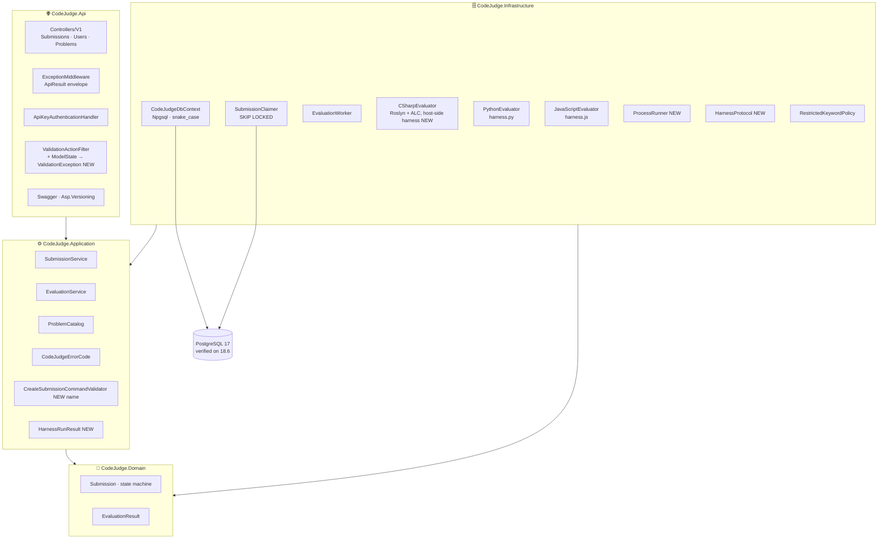

# CodeJudge — System Design v2.0 (As Built)

| | |
|---|---|
| **Document** | System Design |
| **Version** | 2.0 — As Built |
| **Date** | September 2026 |
| **Project** | rubric-runner / CodeJudge |
| **Architecture** | Clean Architecture — Modular Monolith, no CQRS |
| **Verified on** | .NET 10 · PostgreSQL 18.6 (port 5433) · Python 3.14 · Node.js 24 — `scripts/verify-local.*` 12/12 |
| **Author** | Vlachos Evangelos |

---

## 1. What Changed from V1

*System Design v1.0* (`docs/System_Design_v1.md`) describes the intended architecture before implementation began. The design itself went through several drafts before code was written (§1.1); further adjustments were made while building and verifying (§1.2). This document describes the system **as actually built**; every change is listed with its reason. The full deviation table with numbering lives in `PROJECT_STATUS.md`.

### 1.1 Changes between v1 drafts (before code — already reflected in the final v1)

| Area | Earlier v1 draft | Final v1 = as built | Reason |
|---|---|---|---|
| Endpoint style | Minimal APIs + endpoint filter | Controllers (`[ApiController]`, `ControllerBase`) + `ValidationActionFilter` | Attribute routing, per-status `[ProducesResponseType]`, XML docs into Swagger; consistency with the author's existing house style (Vendor Integration Platform) |
| Error responses | RFC 9457 `ProblemDetails` | `ApiResult<T>` envelope + `CodeJudgeErrorCode` integer enum + `ExceptionMiddleware` | One uniform shape for success and error; machine-readable codes independent of message text |
| API versioning | Not specified | `Asp.Versioning.Mvc` URL segment `/api/v{version}/…`, Swagger grouped per version | Visible, cache-friendly, frontend-friendly |
| Evaluation scope | One hard-coded signature and test per language (`sum(a,b)==7`) | `ProblemCatalog` (4 problems, per-language signatures, 4–5 cases each) + language-agnostic JSON harness; `GET /api/v1/problems` | A single assertion demonstrates nothing about evaluation structure; the catalog makes the platform usable and extensible |
| Status representation | Lower-case strings mapped in the API layer | Enums end to end: `HasConversion<string>()` in DB, `JsonStringEnumConverter(JsonNamingPolicy.CamelCase)` on the wire | Brief requires `"pending"` etc.; the converter produces it with zero string literals |
| Database engine | PostgreSQL → SQL Server considered (Docker unavailable) → PostgreSQL | PostgreSQL | Brief's stated preference; a native install replaced Docker |
| Claim query | `UPDLOCK, READPAST` (SQL Server draft) | CTE + `UPDATE … RETURNING` + `FOR UPDATE SKIP LOCKED` | Postgres-native, single round trip |
| Naming convention | PascalCase tables/columns | snake_case via `EFCore.NamingConventions` | Postgres folds unquoted identifiers; quoted PascalCase hostile to `psql` users |
| `EvaluationResult` shape | `Output` text | `output jsonb` + `tests_passed`, `tests_total`, `duration_ms` | Harness produces structured per-case data; counts queried without JSON functions |
| Integration test DB | SQLite in-memory | EF InMemory + no-op `ISubmissionClaimer` | Worker inert so tests are deterministic |

### 1.2 Changes between the final v1 and the code

| # | Area | V1 design | V2 actual | Reason |
|---|---|---|---|---|
| 1 | `ICodeEvaluator.RunAsync` (§6.5) | returns `IReadOnlyList<TestCaseResult>` | returns `HarnessRunResult` — cases + `TimedOut`, `Stderr`, `DurationMs` | A bare case list cannot express "the whole run timed out" or "the harness crashed with no per-case results"; `EvaluationService` needs both to build the `Test` result |
| 2 | Timeouts (§10 vs DD §8) | SD lists one `Evaluation:TimeoutSeconds`; DD lists two | `CompileTimeoutSeconds` (10) + `RunTimeoutSeconds` (5), per DD | Compile and run have different cost profiles |
| 3 | Validator name (§6.7) | `CreateSubmissionRequestValidator` | `CreateSubmissionCommandValidator` on the Application command; the filter maps request → command | Rules testable without the API project |
| 4 | `EvaluationResult` factories (DD §9) | `Passed` / `Failed` / `SkippedResult` | `Pass` / `Fail` / `Skip` | `Passed` collides with the `bool Passed` data property |
| 5 | Start-up migrations (§10) | Always in Development | Guarded by `Database:ApplyMigrationsOnStartup` and skipped for non-relational providers | Integration tests use EF InMemory through the same `Program` |
| 6 | C# execution harness (§6.5) | User code + generated harness class compiled together; harness invoked via reflection | User code alone is compiled; the harness loop (argument binding, invocation, JSON shaping) runs **host-side by reflection** over the loaded assembly | No `System.Text.Json` in user compilations; one harness protocol implementation instead of generated C#; identical observable contract |
| 7 | C# submission shape (§6.5) | Signature only, e.g. `int Sum(int a, int b)` | A bare method is wrapped in a generated `public class Solution`; a submission that declares a type/namespace is compiled unchanged; `System`, `System.Collections.Generic`, `System.Linq`, `System.Text` are implicit global usings | A compilation unit cannot contain a bare method; both shapes keep the documented signature honest |
| 8 | C# timeout semantics (§6.5) | "On timeout the context is unloaded and the case marked `Timed out`" | The run is reported as timed out and stops; the runaway thread is **abandoned**; `AssemblyLoadContext.Unload()` is requested and completes only once that thread ends | .NET has no safe thread abort — the in-process weak spot named in v1 §11 |
| 9 | C# compile references (§6.5, unspecified) | — | Fixed BCL allow-list: `System.Private.CoreLib`, `System.Runtime`, `System.Runtime.Extensions`, `System.Collections`, `System.Linq`, `System.Console`, `System.Text.RegularExpressions` | The full trusted-platform set would expose `Process`, `System.IO`, `System.Net` at compile time regardless of the keyword check |
| 10 | Local database (§6.11, §10) | PostgreSQL 17 on `localhost:5432`, `postgres`/`postgres` | Verified on **PostgreSQL 18.6, port 5433**, dedicated `codejudge` login (in `appsettings.Development.json`); `appsettings.json` and `docker-compose.yml` keep the v1 default | Two PostgreSQL services on the dev machine (16 on 5432, 18 on 5433); least-privilege login instead of the superuser; nothing version-specific is used |
| 11 | Binding errors (§6.7, §6.10) | Not specified | `ValidationActionFilter` converts `ModelState` binding failures (malformed JSON, `"language": "cobol"`) into `ValidationException`: `language` → `400/3002`, other → `400/1000` | With the built-in 400 suppressed, binding failures otherwise reached the action with a null body → `500/0` (found during live verification) |
| 12 | Lock duration (§4.1, §7 vs DD §8) | SD says 60 s, DD says 90 s | 90 s | The v1 documents disagreed; 90 s covers compile + run for a batch with margin |
| 13 | Docker (§5.4, §6.11) | `docker-compose.yml` as the zero-install path | `postgres:17` + api (multi-stage image with `python3` + `nodejs`, non-root); compose validated with `docker compose config`; **image build not executed** | Docker Desktop daemon unavailable on the dev machine — unverified, not changed |
| — | `Location` header (§6.10) | `/api/v1/submissions/{id}` | As designed — required `RouteOptions.LowercaseUrls` and route value `version = "1"` (was rendering `/api/v1.0/Submissions/{id}`) | Found and fixed during live verification |
| — | Health check (§10) | `/health` DB connectivity, anonymous | `AspNetCore.HealthChecks.NpgSql`; plain-text `Healthy`/`Unhealthy` | As designed |

---

## 2. Architecture — V2 Layer Diagram

The four-layer Clean Architecture from v1 is retained. Components added or renamed during implementation are marked **(NEW)**.



*Figure 1 — Layers as built. Dependency rule unchanged and enforced by `DependencyRuleTests` (NetArchTest): Domain depends on nothing, Application never on Infrastructure/Api/EF Core, Infrastructure never on Api.*

---

## 3. Request Pipeline (as built)

```
Request
  → ExceptionMiddleware            (catches everything below, writes ApiResult; 4xx warning, 5xx error + TraceId)
  → Serilog request logging
  → Swagger (anonymous)
  → Authentication (ApiKey scheme) → 401 ApiResult(4001) on failure
  → Authorization ([Authorize] on all controllers; /health anonymous)
  → MVC: ValidationActionFilter
        ModelState invalid (malformed JSON, unknown enum) → ValidationException → 400 ApiResult(3002 for language, else 1000)
        FluentValidation on the mapped command           → ValidationException → 400 ApiResult(1000 / 2002 / 3001 / 3002)
  → Controller action → ISubmissionService
  → NotFoundException → 404 ApiResult(2001) · InvalidStatusTransitionException → 409 ApiResult(1002)
```

`SuppressModelStateInvalidFilter = true` so that even malformed JSON produces an `ApiResult`, not the framework's `ValidationProblemDetails`. `RouteOptions.LowercaseUrls = true` so generated links (the `201 Location`) read `/api/v1/submissions/{id}`.

---

## 4. Evaluation Pipeline (as built)

```
EvaluationWorker (BackgroundService, poll every 2 s)
  claim ≤ 5 rows  ── CTE + UPDATE … RETURNING … FOR UPDATE SKIP LOCKED   (lock 90 s)
  for each row (log scope SubmissionId + WorkerId):
    attempt_count > MaxAttempts (3) → Fail("Max attempts exceeded.")
    EvaluationService.EvaluateAsync
      1. RestrictedKeywordPolicy.Check      → match ⇒ Security=fail, Compiles/Test skipped
      2. ICodeEvaluator.CompileAsync        → fail ⇒ Compiles=fail (+diagnostics JSON), Test skipped
      3. ICodeEvaluator.RunAsync(problem)   → HarnessRunResult: all cases in one process/run
         deep JSON compare actual vs expected → Test passed iff every case passes
         TimedOut ⇒ "Timed out after N ms"; no cases + stderr ⇒ harness crash message
    Submission.Complete(3 results) → SaveChangesAsync
    any exception → Submission.Fail(message), continue loop
```

| Language | Compile | Run | Isolation |
|---|---|---|---|
| C# | Roslyn `CSharpCompilation` of the user code (bare method wrapped in a generated `Solution` class); error diagnostics returned with user line numbers | Assembly emitted to memory, loaded into a collectible `AssemblyLoadContext`; the function is found by name via reflection, arguments bound from the case JSON, each case invoked on a pool thread under `Task.WaitAsync(RunTimeout)`; result serialised to JSON and deep-compared | **In-process** — timed-out thread abandoned, unload best-effort; fixed BCL reference allow-list. Documented limitation |
| Python | `python -c "import ast,sys; ast.parse(sys.stdin.read())"` — `SyntaxError` text and line returned | `python <tmp>.py` with `harness.py` appended, cases as JSON on stdin, results as JSON on stdout | Child process, `Kill(entireProcessTree: true)` on timeout |
| JavaScript | `node --check <tmp>.js` — `SyntaxError` text and line returned (temp path scrubbed) | `node <tmp>.js` with `harness.js` appended, same protocol | Child process, same |

Harness protocol unchanged from v1 §6.5; `HarnessProtocol.Parse` turns the harness stdout into a `HarnessRunResult` for Python and JavaScript, and `CSharpEvaluator` produces the same shape directly.

---

## 5. Design Decisions Made or Confirmed During Implementation

**Why controllers over minimal APIs after all.** An early draft chose minimal APIs for brevity. Once the `ApiResult` envelope, per-status `ProducesResponseType` and XML documentation became requirements (to match the author's existing API style), controllers were the shorter path — the filter pipeline and Swashbuckle integration are mature there.

**Why `ApiResult<T>` instead of `ProblemDetails`.** A frontend checking one `status` boolean and one `errorCode` integer is simpler than branching on content type. The trade-off (loss of RFC 9457 interoperability) is accepted and recorded.

**Why the problem catalog lives in code.** Problems change with a deployment, are covered by a self-test (`ProblemCatalogTests`), and need no admin UI. Tables are the first evolution step and only justified when problems must change without deploying.

**Why validation of `problemId` happens at `POST`.** The worker can assume every claimed row references an existing problem; an unknown problem is the client's error (`400 / 3001`), not a system error discovered seconds later.

**Why the C# harness runs host-side.** Generating a harness class into the user's compilation would have meant referencing `System.Text.Json` from untrusted code and maintaining a second copy of the protocol in generated C#. Reflection from the host binds JSON arguments to the method's parameter types with `JsonSerializer.Deserialize`, invokes, and serialises the return value — the same per-case `actual`/`error`/`durationMs` shape the scripts produce.

**Why PostgreSQL 18.6 on port 5433 locally.** The dev machine had a pre-existing PostgreSQL 16 service on 5432 with unknown credentials and a fresh PostgreSQL 18 install on 5433. A dedicated `codejudge` login and database were created rather than using the superuser. Nothing in the schema or queries is version-specific; the compose file still targets 17.

**Why no retry/backoff on evaluation failures.** Compile and test failures are deterministic; retrying them is wrong. The only retry is the implicit re-claim after `locked_until` expiry, bounded by `MaxAttempts`.

---

## 6. What Was Not Implemented or Verified from V1

Everything in v1 §2 (acceptance criteria) and §12 (testing strategy, including the "optional" architecture and integration tiers) is implemented and was verified live: three languages to `completed` 4/4, the security short-circuit, every error code, catalog and history — `scripts/verify-local.*`, 12/12. The remaining items:

| V1 item | Where in v1 | Status / reason |
|---|---|---|
| Docker image build | §5.4 / §6.11 | **Not executed** — Docker Desktop daemon unavailable during development; `docker compose config` validated only |
| Load testing | §12 | Deferred as designed |
| Architecture test for "Api does not reference Infrastructure" | §12 | Not asserted — `Api → Infrastructure` is required for composition; the rules asserted are Domain → nothing, Application ↛ Infrastructure/Api/EF Core, Infrastructure ↛ Api |
| Generated C# harness class | §6.5 | Replaced by host-side reflection (§1.2 row 6) |

---

## 7. Open Discussions

**Sandboxing.** In-process C# execution is the weakest point of the system: a timed-out thread cannot be killed and the reference allow-list only narrows the API surface. The clean fix is a per-submission container (or Firecracker microVM) behind the unchanged `ICodeEvaluator` boundary, with the worker extracted to its own deployable and a queue between API and worker. Not started.

**Docker build.** The image has not been built; the first run on a machine with a Docker daemon should confirm the `apt-get` layer, the `python` symlink the Python evaluator relies on, and the non-root user's write access to the temp directory the evaluators use.

**Test-case visibility.** `GET /problems` exposes only `IsSample = true` cases. A client may want to see all cases after a completed submission; the `output` JSON already contains them per submission, so this is a DTO decision, not a schema one.

**Multi-tenancy of `userId`.** With a static API key, `userId` is trusted from the client. JWT would move it to the `sub` claim; `UsersController` would then filter by the caller's identity rather than a path parameter.

---

*CodeJudge — System Design v2.0 (As Built) — September 2026 — Author: Vlachos Evangelos*
