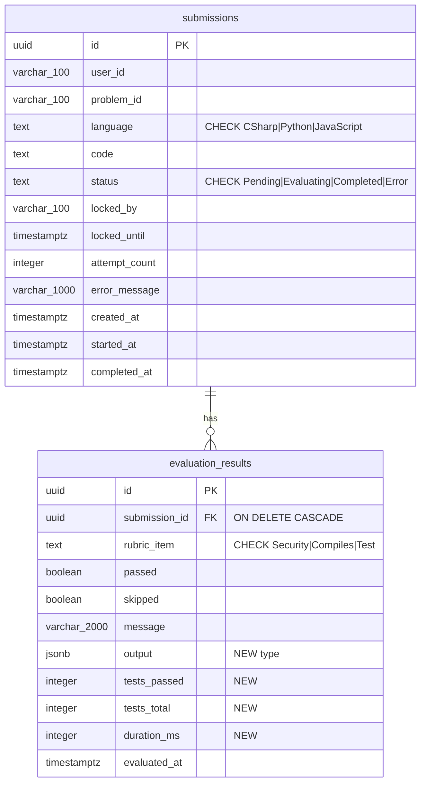

# CodeJudge — Database Design v2.0 (As Built)

| | |
|---|---|
| **Document** | Database Design |
| **Version** | 2.0 — As Built |
| **Date** | September 2026 |
| **Project** | RubricRunner / CodeJudge |
| **Target DB** | PostgreSQL 16/17 — EF Core 10 + Npgsql, snake_case, migration `InitialCreate` |
| **Author** | Vlachos Evangelos |

---

## 1. What Changed from V1

| Entity / Area | Change | Reason |
|---|---|---|
| Engine | PostgreSQL → SQL Server (draft) → **PostgreSQL**; verified on **16**, designed for 17 | Docker unavailable, native SQL Server considered, then a native PostgreSQL install was set up; brief prefers Postgres |
| Naming | PascalCase → **snake_case** (`EFCore.NamingConventions`) | Postgres identifier folding; `psql`/pgAdmin friendliness |
| Types | `uniqueidentifier`/`nvarchar`/`datetime2` (SQL Server draft) → `uuid`/`varchar`/`text`/`timestamptz` | Engine reverted |
| `evaluation_results` | Added `output jsonb` (was `text`), `tests_passed int`, `tests_total int`, `duration_ms int`; check `tests_passed <= tests_total` | Harness returns structured per-case results; counts queried without JSON functions |
| `evaluation_results` | Kept surrogate `id` + `UNIQUE (submission_id, rubric_item)` | As designed; avoids composite-key friction seen in VIP |
| `submissions` | No schema change from the final v1 draft | — |
| Claim query | `UPDLOCK, READPAST` (SQL Server draft) → **CTE + `UPDATE … RETURNING` + `FOR UPDATE SKIP LOCKED`** | Engine reverted |
| Indexes | Partial index syntax (`HasFilter("status IN ('Pending','Evaluating')")`) and `IncludeProperties` confirmed supported by Npgsql | As designed |
| Enum storage | `text` via `HasConversion<string>()` + `CHECK` constraints confirmed; Postgres native `ENUM` types not used | As designed |
| Migrations | Single `InitialCreate` (2026-09-04); applied on startup only when `Database:ApplyMigrationsOnStartup = true` and provider is relational | Guard added so the EF InMemory integration tests share `Program.cs` |
| PK generation | `Guid.CreateVersion7()` in domain | As designed |

No columns were removed, no statuses added or renamed, and the two-table shape held. The v1 database design survived implementation with additive changes only.

---

## 2. V2 Entity Relationship Diagram



*Figure 1 — As-built schema. Only `evaluation_results` differs from the first v1 draft.*

---

## 3. Schema Reference (as built)

### submissions

| Column | Type | Constraints |
|---|---|---|
| `id` | uuid | PK |
| `user_id` | varchar(100) | NOT NULL |
| `problem_id` | varchar(100) | NOT NULL — validated against in-code catalog, not a FK |
| `language` | text | NOT NULL, `CHECK (language IN ('CSharp','Python','JavaScript'))` |
| `code` | text | NOT NULL |
| `status` | text | NOT NULL, `CHECK (status IN ('Pending','Evaluating','Completed','Error'))` |
| `locked_by` | varchar(100) | NULL |
| `locked_until` | timestamptz | NULL |
| `attempt_count` | integer | NOT NULL DEFAULT 0 |
| `error_message` | varchar(1000) | NULL |
| `created_at` | timestamptz | NOT NULL |
| `started_at` | timestamptz | NULL |
| `completed_at` | timestamptz | NULL |

### evaluation_results

| Column | Type | Constraints |
|---|---|---|
| `id` | uuid | PK |
| `submission_id` | uuid | FK → submissions(id) ON DELETE CASCADE, NOT NULL |
| `rubric_item` | text | NOT NULL, `CHECK (rubric_item IN ('Security','Compiles','Test'))` |
| `passed` | boolean | NOT NULL |
| `skipped` | boolean | NOT NULL DEFAULT false |
| `message` | varchar(2000) | NULL |
| `output` | jsonb | NULL — `{ "diagnostics": [...] }` for Compiles, `{ "cases": [...] }` for Test |
| `tests_passed` | integer | NULL |
| `tests_total` | integer | NULL |
| `duration_ms` | integer | NULL |
| `evaluated_at` | timestamptz | NOT NULL |
| — | — | `CHECK (tests_passed IS NULL OR tests_total IS NULL OR tests_passed <= tests_total)` |

---

## 4. Indexes (as built)

| Index | Table | Definition | Status |
|---|---|---|---|
| `pk_submissions` | submissions | `(id)` | As designed |
| `ix_submissions_queue` | submissions | `(status, locked_until, created_at) WHERE status IN ('Pending','Evaluating')` | As designed — partial |
| `ix_submissions_user_id_created_at` | submissions | `(user_id, created_at DESC) INCLUDE (problem_id, language, status)` | As designed — covering |
| `pk_evaluation_results` | evaluation_results | `(id)` | As designed |
| `ux_evaluation_results_submission_rubric` | evaluation_results | `UNIQUE (submission_id, rubric_item)` | As designed |

No index was added or removed relative to the final v1 draft. No boolean or low-cardinality index exists.

---

## 5. Claim Query (as built)

```sql
WITH candidates AS (
    SELECT id FROM submissions
    WHERE  status = 'Pending'
       OR (status = 'Evaluating' AND locked_until < now())
    ORDER  BY created_at
    LIMIT  @batchSize
    FOR UPDATE SKIP LOCKED
)
UPDATE submissions s
SET    status = 'Evaluating', locked_by = @workerId, locked_until = @lockUntil,
       attempt_count = s.attempt_count + 1,
       started_at = COALESCE(s.started_at, now())
FROM   candidates c WHERE s.id = c.id
RETURNING s.*;
```

Executed with `Database.SqlQueryRaw<Submission>` in `SubmissionClaimer`; the returned entities are attached to the context so the subsequent `Complete()`/`Fail()` mutations are tracked. This remains the single documented exception to "all mutations go through domain methods".

---

## 6. Corrections and Confirmations

| Topic | Finding |
|---|---|
| `Guid.CreateVersion7()` | Available in .NET 9+; used as designed. Inserts observed as append-mostly in the PK index. |
| `jsonb` with EF Core | Mapped as `string` property with `HasColumnType("jsonb")`; serialised by the evaluator. Considered `JsonDocument` mapping — rejected to keep Domain free of `System.Text.Json` dependence. |
| `timestamptz` and Npgsql | Npgsql requires `DateTime.Kind == Utc`; all timestamps are set with `DateTime.UtcNow` in the domain. No `DateTimeOffset` needed. |
| Check constraints on enum text | Generated with `HasCheckConstraint`; verified present in `InitialCreate`. |
| Cascade delete | Present; no endpoint deletes, so unexercised in production paths. |

---

## 7. What Was Not Implemented from V1

| V1 item | Reason |
|---|---|
| Nothing from the final v1 draft was dropped | The two-table design held; all changes were additive |
| `problems` / `test_cases` tables | Never in v1 scope — evolution path (§8) |

---

## 8. Evolution Path (unchanged from v1 §11, with one addition)

| Change | Trigger | Impact |
|---|---|---|
| `users` table + FK | JWT | `user_id` → `uuid` FK |
| `problems` + `problem_signatures` + `test_cases` | Problems must change without deploy | `problem_id` → FK; `IProblemCatalog` → repository |
| `test_case_results` table | Per-case analytics | Extract from `output` |
| Split queue columns to `submission_jobs` | Polling contention at scale | 1:1 FK |
| `score` + materialised view | Leaderboard | First CQRS read model |
| Retention / partitioning by `created_at` | Table growth | Scheduled purge; cascade already in place |
| **PostgreSQL 17 verification** | Deployment target | Re-run `verify-local` against 17; no schema change expected |

---

*CodeJudge — Database Design v2.0 (As Built) — September 2026 — Author: Vlachos Evangelos*
