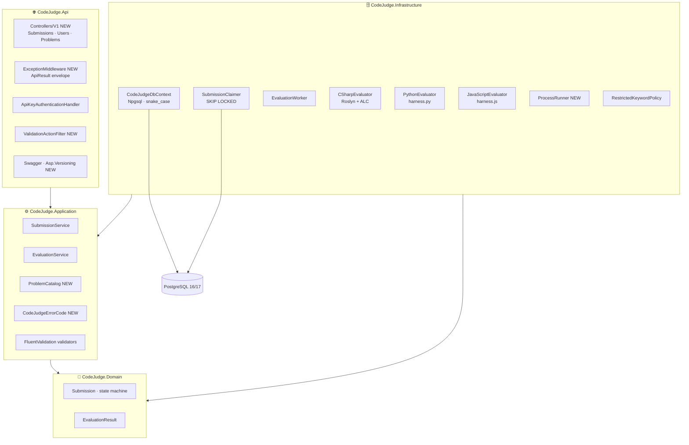

# CodeJudge — System Design v2.0 (As Built)

| | |
|---|---|
| **Document** | System Design |
| **Version** | 2.0 — As Built |
| **Date** | September 2026 |
| **Project** | RubricRunner / CodeJudge |
| **Architecture** | Clean Architecture — Modular Monolith, no CQRS |
| **Author** | Vlachos Evangelos |

---

## 1. What Changed from V1

*System Design v1.0* described the intended architecture before implementation began. The design itself went through three drafts before code was written (minimal APIs → controllers; PostgreSQL → SQL Server → PostgreSQL; single test → problem catalog), and further adjustments were made during implementation. This document describes the system **as actually built**; every change is listed with its reason.

| Area | V1 design (first draft) | V2 actual | Reason |
|---|---|---|---|
| Endpoint style | Minimal APIs + endpoint filter | Controllers (`[ApiController]`, `ControllerBase`) + `ValidationActionFilter` | Attribute routing, per-status `[ProducesResponseType]`, XML docs into Swagger; consistency with the author's existing house style (Vendor Integration Platform) |
| Error responses | RFC 9457 `ProblemDetails` | `ApiResult<T>` envelope + `CodeJudgeErrorCode` integer enum + `ExceptionMiddleware` | One uniform shape for success and error; machine-readable codes independent of message text |
| API versioning | Not specified | `Asp.Versioning.Mvc` URL segment `/api/v{version}/…`, Swagger grouped per version | Visible, cache-friendly, frontend-friendly |
| Evaluation scope | One hard-coded signature and test per language (`sum(a,b)==7`) | `ProblemCatalog` (4 problems, per-language signatures, 4–5 cases each) + language-agnostic JSON harness; `GET /api/v1/problems` | A single assertion demonstrates nothing about evaluation structure; catalog makes the platform usable and extensible |
| Status representation | Lower-case strings mapped in API layer | Enums end to end: `HasConversion<string>()` in DB, `JsonStringEnumConverter(JsonNamingPolicy.CamelCase)` on the wire | Brief requires `"pending"` etc.; converter produces it with zero string literals |
| Database engine | PostgreSQL → SQL Server (Docker unavailable on dev machine) → **PostgreSQL** | PostgreSQL (native install), verified locally against **PostgreSQL 16**; design targets 17 | Returned to the brief's stated preference once a native install replaced Docker; nothing 17-specific is used |
| Claim query | `FOR UPDATE SKIP LOCKED` (v1) → `UPDLOCK, READPAST` (SQL Server draft) → **CTE + `UPDATE … RETURNING` + `FOR UPDATE SKIP LOCKED`** | Postgres-native, single round trip | Engine reverted |
| Naming convention | PascalCase tables/columns | snake_case via `EFCore.NamingConventions` | Postgres folds unquoted identifiers; quoted PascalCase hostile to `psql` users |
| `EvaluationResult` shape | `Output` text | `output jsonb` + `tests_passed`, `tests_total`, `duration_ms` | Harness produces structured per-case data; counts queried without JSON functions |
| Timeouts | Single `TimeoutSeconds` | `CompileTimeoutSeconds` (10) + `RunTimeoutSeconds` (5) | Compile and run have different cost profiles |
| Lock duration | 60 s | 90 s | Must exceed compile timeout + harness run with margin |
| Startup migrations | Always in Development | Guarded by `Database:ApplyMigrationsOnStartup` and skipped for non-relational providers | Integration tests use EF InMemory through the same `Program` |
| Integration test DB | SQLite in-memory (first draft) | EF InMemory + no-op `ISubmissionClaimer` | Same approach as VIP; worker inert so tests are deterministic |
| C# execution | "Roslyn in-process" (one line) | Roslyn `CSharpCompilation` of user code + generated harness class, collectible `AssemblyLoadContext`, reflection invoke, `Task.WaitAsync(timeout)`, context unloaded after run | Implemented as designed; documented as not a sandbox |
| Docker | `postgres:17` + api | `postgres:17` + api (multi-stage image with `python3` + `nodejs`); compose validated, image build not verified locally (Docker Desktop unavailable) | Deliverable present; verification pending |
| Health check | `/health` DB connectivity | `AspNetCore.HealthChecks.NpgSql`, anonymous | As designed |

---

## 2. Architecture — V2 Layer Diagram

The four-layer Clean Architecture from v1 is retained. Components added or renamed during implementation are marked **(NEW)**.



*Figure 1 — Layers as built. Dependency rule unchanged and enforced by `DependencyRuleTests` (NetArchTest).*

---

## 3. Request Pipeline (as built)

```
Request
  → ExceptionMiddleware            (catches everything below, writes ApiResult)
  → Serilog request logging
  → Swagger (anonymous)
  → Authentication (ApiKey scheme) → 401 ApiResult(4001) on failure
  → Authorization ([Authorize] on all controllers)
  → MVC: ValidationActionFilter    → ValidationException → 400 ApiResult(1000 / 2002 / 3001 / 3002)
  → Controller action → ISubmissionService
  → NotFoundException → 404 ApiResult(2001) · InvalidStatusTransitionException → 409 ApiResult(1002)
```

`SuppressModelStateInvalidFilter = true` so that even malformed JSON produces an `ApiResult`, not the framework's `ValidationProblemDetails`.

---

## 4. Evaluation Pipeline (as built)

```
EvaluationWorker (BackgroundService, poll every 2 s)
  claim ≤ 5 rows  ── CTE + UPDATE … RETURNING … FOR UPDATE SKIP LOCKED
  for each row:
    attempt_count > MaxAttempts → Fail("Max attempts exceeded")
    EvaluationService.EvaluateAsync
      1. RestrictedKeywordPolicy.Check      → fail ⇒ Security=fail, Compiles/Test skipped
      2. ICodeEvaluator.CompileAsync        → fail ⇒ Compiles=fail (+diagnostics), Test skipped
      3. ICodeEvaluator.RunAsync(problem)   → harness runs all cases in one process
         deep JSON compare actual vs expected → Test passed iff all cases pass
    Submission.Complete(3 results) → SaveChangesAsync
    any exception → Submission.Fail(message), continue loop
```

| Language | Compile | Run | Isolation |
|---|---|---|---|
| C# | Roslyn `CSharpCompilation.Emit` (user code + generated `__Harness` class) | Collectible `AssemblyLoadContext`, reflection, `Task.WaitAsync(RunTimeout)`, unload | **In-process** — documented limitation |
| Python | `python -c "import ast,sys; ast.parse(sys.stdin.read())"` | `python harness.py` (user code prepended), JSON stdin/stdout | Child process, `Kill(entireProcessTree)` on timeout |
| JavaScript | `node --check` | `node harness.js`, JSON stdin/stdout | Child process, same |

Harness protocol unchanged from v1 §6.5.

---

## 5. Design Decisions Made or Confirmed During Implementation

**Why controllers over minimal APIs after all.** The v1 first draft chose minimal APIs for brevity. Once the `ApiResult` envelope, per-status `ProducesResponseType` and XML documentation became requirements (to match the author's existing API style), controllers were the shorter path — the filter pipeline and Swashbuckle integration are mature there.

**Why `ApiResult<T>` instead of `ProblemDetails`.** A frontend checking one `status` boolean and one `errorCode` integer is simpler than branching on content type. The trade-off (loss of RFC 9457 interoperability) is accepted and recorded.

**Why the problem catalog lives in code.** Problems change with a deployment, are covered by a self-test (`ProblemCatalogTests`), and need no admin UI. Tables are the first evolution step and only justified when problems must change without deploying.

**Why validation of `problemId` happens at `POST`.** The worker can assume every claimed row references an existing problem; an unknown problem is the client's error (`400 / 3001`), not a system error discovered seconds later.

**Why PostgreSQL 16 locally.** A native PostgreSQL 16 service was already installed; Docker Desktop was unavailable. Nothing in the schema or queries is 17-specific; the compose file still targets 17.

**Why no retry/backoff on evaluation failures.** Compile and test failures are deterministic; retrying them is wrong. The only retry is the implicit re-claim after `locked_until` expiry, bounded by `MaxAttempts`.

---

## 6. What Was Not Implemented from V1

| V1 item | Where in v1 | Reason |
|---|---|---|
| RFC 9457 `ProblemDetails` | §6.10 first draft | Replaced by `ApiResult<T>` envelope (see §1) |
| Minimal APIs | §5.3 first draft | Replaced by controllers |
| SQLite for integration tests | §6.11 first draft | EF InMemory used instead (no `SKIP LOCKED` needed in tests; worker is inert) |
| Docker image build verification | §5.4 / repo files | Docker Desktop unavailable during development; compose validated with `docker compose config` only |
| Load testing | §12 | Deferred as designed |
| Architecture test for "Api does not reference Infrastructure" | §12 | Only the two rules "Domain references nothing" and "Application does not reference Infrastructure/Api" are asserted; `Api → Infrastructure` is required for composition |

---

## 7. Open Discussions

**Sandboxing.** In-process C# execution is the weakest point of the system. The clean fix is a per-submission container (or Firecracker microVM) behind the unchanged `ICodeEvaluator` boundary, with the worker extracted to its own deployable and a queue between API and worker. Not started.

**Test-case visibility.** Currently `GET /problems` exposes only `IsSample = true` cases. A client may want to see all cases after a completed submission; the `output` JSON already contains them per submission, so this is a DTO decision, not a schema one.

**Multi-tenancy of `userId`.** With a static API key, `userId` is trusted from the client. JWT would move it to the `sub` claim; `UsersController` would then filter by the caller's identity rather than a path parameter.

---

*CodeJudge — System Design v2.0 (As Built) — September 2026 — Author: Vlachos Evangelos*
